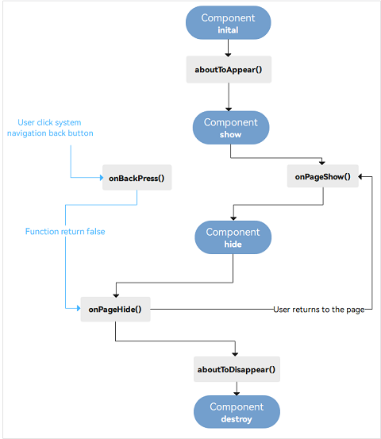

# ArkTS

## 装饰器

装饰类、结构、方法、变量，赋予其特殊的含义

### @Component

_自定义组件_

### @Entry

### @Builder

_`@Entry` 装饰的自定义组件用作页面的默认入口组件，加载页面时，将首先创建并呈现@Entry 装饰的自定义组件_

### @State

_`@State`装饰的变量是组件内部的状态数据，当这些状态数据被修改时，将会调用所在组件的 build 方法进行 UI 刷新_

### @Prop

_`@Prop`与@State 有相同的语义，但初始化方式不同。@Prop 装饰的变量必须使用其父组件提供的@State 变量进行初始化，允许组件内部修改@Prop 变量，但更改不会通知给父组件，即@Prop 属于单向数据绑定。_

```js
@Component
export default struct TargetList {
  @State isEditMode: boolean = false;
  ...
  build() {
    Column() {
      ...
      List({ space: CommonConstants.LIST_SPACE }) {
        ForEach(this.targetData, (item: TaskItemBean, index: number) => {
          ListItem() {
            TargetListItem({
              isEditMode: this.isEditMode,
              ...
            })
          }
        }, (item, index) => JSON.stringify(item) + index)
      }
      ...
    }
    ...
  }
}
```

```js
@Component
export default struct TargetListItem {
   @Prop isEditMode: boolean;
}
```

### @Link

_`@Link`装饰的变量可以和父组件的@State 变量建立双向数据绑定，需要注意的是：@Link 变量不能在组件内部进行初始化。_

```js
@Component
export default struct TargetList {
  @State clickIndex: number = CommonConstants.DEFAULT_CLICK_INDEX;
  ...
             TargetListItem({
               clickIndex: $clickIndex,
              ...
             })
  ...
}
```

```js
@Component
export default struct TargetListItem {
  @Link @Watch('onClickIndexChanged') clickIndex: number;
}
```

_`@Builder`装饰的方法用于定义组件的声明式 UI 描述，在一个自定义组件内快速生成多个布局内容。_

### @Watch

```js
@Component
export default struct TargetListItem {
  @Link @Watch('onClickIndexChanged') clickIndex: number;
  @State isExpanded: boolean = false
  ...

  onClickIndexChanged() {
    if (this.clickIndex != this.index) {
      this.isExpanded = false;
    }
  }

  build() {
    ...
       Column() {
        ...
       }
       .onClick(() => {
        ...
           this.clickIndex = this.index;
        ...
       })
    ...
  }
}
```

### @Extend

### @Provide、@Consume

跨组件传值

### @Observed、@ObjectLink

## 生命周期



### aboutToAppear

`aboutToAppear` 在创建自定义组件的实例后，执行其 `build` 函数之前执行

### aboutToDisappear

### onPageShow

### onPageHide

### onBackPress

```js
onBackPress(){
    return false; //return true 时，表示页面自己处理返回逻辑，不进行页面返回。 false为由系统返回逻辑，为默认值。
}
```

!> 需要注意的是，部分生命周期回调函数仅对`@Entry` 修饰的自定义组件生效，它们分别是：`onPageShow`、`onPageHide`、`onBackPress`。

## 动画

```js
Image($r("app.media.image1")).animation({
  duration: 1000,
  tempo: 1.0,
  delay: 0,
  curve: Curve.Linear,
  playMode: PlayMode.Normal,
  iterations: 1,
});
```

| 属性名称   | 属性类型 | 默认值          | 描述                                                                    |
| ---------- | -------- | --------------- | ----------------------------------------------------------------------- |
| duration   | number   | 1000            | 动画时长，单位为毫秒，默认时长为 1000 毫秒。                            |
| tempo      | number   | 1.0             | 动画的播放速度，值越大动画播放越快，值越小播放越慢，为 0 时无动画效果。 |
| curve      | Curve    | Curve.Linear    | 动画变化曲线，默认曲线为线性。                                          |
| delay      | number   | 0               | 延时播放时间，单位为毫秒，默认不延时播放。                              |
| iterations | number   | 1               | 播放次数，默认一次，设置为-1 时表示无限次播放。                         |
| playMode   | PlayMode | PlayMode.Normal | 设置动画播放模式，默认播放完成后重头开始播放。                          |
| onFinish   | function | -               | 动画播放结束时回调该函数。                                              |

## Web 组件

```js
@Entry
@Component
struct WebComponent {
  controller: WebController = new WebController();
  build() {
    Column() {
      Web({ src: 'https://developer.harmonyos.com/', controller: this.controller })
    }
  }
}
```

## HTTP

- 1、导入 http 模块。

```js
import http from "@ohos.net.http";
```

- 2、创建 httpRequest 对象。

```js
let httpRequest = http.createHttp();
```

!> 需要注意的是每一个 httpRequest 对象对应一个 http 请求任务，不可复用。

- 3、订阅请求头（可选）。**不懂**

用于订阅 http 响应头，此接口会比 request 请求先返回。

```js
httpRequest.on("headersReceive", (header) => {
  console.info("header: " + JSON.stringify(header));
});
```

- 4、发起 http 请求

```js
let url = "https://EXAMPLE_URL?param1=v1&param2=v2";
let promise = httpRequest.request(
  // 请求url地址
  url,
  {
    // 请求方式
    method: http.RequestMethod.GET,
    // 可选，默认为60s
    connectTimeout: 60000,
    // 可选，默认为60s
    readTimeout: 60000,
    // 开发者根据自身业务需要添加header字段
    header: {
      "Content-Type": "application/json",
    },
  }
);
```

```js
let url = "https://EXAMPLE_URL";
let promise = httpRequest.request(
  // 请求url地址
  url,
  {
    // 请求方式
    method: http.RequestMethod.POST,
    // 请求的额外数据。
    extraData: {
      param1: "value1",
      param2: "value2",
    },
    // 可选，默认为60s
    connectTimeout: 60000,
    // 可选，默认为60s
    readTimeout: 60000,
    // 开发者根据自身业务需要添加header字段
    header: {
      "Content-Type": "application/json",
    },
  }
);
```

- 5、处理响应结果

```js
promise
  .then((data) => {
    if (data.responseCode === http.ResponseCode.OK) {
      console.info("Result:" + data.result);
      console.info("code:" + data.responseCode);
    }
  })
  .catch((err) => {
    console.info("error:" + JSON.stringify(err));
  });
```

## 数据存储

### preferences

```js
// PreferencesUtil.ets
import dataPreferences from '@ohos.data.preferences';
...
const PREFERENCES_NAME = 'myPreferences'; // 首选项名字
const KEY_APP_FONT_SIZE = 'appFontSize';  // 首选项Key字段

createFontPreferences(context) {
    globalThis.getFontPreferences = (() => {
        // 获取首选项实例
        let preferences: Promise<dataPreferences.Preferences> = dataPreferences.getPreferences(context, PREFERENCES_NAME);
        return preferences;
    });
}

saveDefaultFontSize(fontSize: number) {
    globalThis.getFontPreferences().then((preferences) => {
      // 判断保存的key是否存在
      preferences.has(KEY_APP_FONT_SIZE).then(async (isExist) => {
        Logger.info(TAG, 'preferences has changeFontSize is ' + isExist);
        if (!isExist) {
          // 保存数据
          await preferences.put(KEY_APP_FONT_SIZE, fontSize);
          preferences.flush();
        }
      }).catch((err) => {
        Logger.error(TAG, 'Has the value failed with err: ' + err);
      });
    }).catch((err) => {
      Logger.error(TAG, 'Get the preferences failed, err: ' + err);
    });
  }

saveChangeFontSize(fontSize: number) {
    globalThis.getFontPreferences().then(async (preferences) => {
        // 保存数据
        await preferences.put(KEY_APP_FONT_SIZE, fontSize);
        preferences.flush();
    }).catch((err) => {
        Logger.error(TAG, 'put the preferences failed, err: ' + err);
    });
}

async getChangeFontSize() {
    let fontSize: number = 0;
    const preferences = await globalThis.getFontPreferences();
    fontSize = await preferences.get(KEY_APP_FONT_SIZE, fontSize); //第二参数默认值
    return fontSize;
}

async deleteChangeFontSize() {
    const preferences: dataPreferences.Preferences = await globalThis.getFontPreferences();
    // 删除数据
    let deleteValue = preferences.delete(KEY_APP_FONT_SIZE);
    deleteValue.then(() => {
      Logger.info(TAG, 'Succeeded in deleting the key appFontSize.');
    }).catch((err) => {
      Logger.error(TAG, 'Failed to delete the key appFontSize. Cause: ' + err);
    });
  }
```

- 1、获取首选项实例

```js
// entryAbility.ets
onCreate(want, launchParam) {
Logger.info(TAG, 'onCreate');
globalThis.abilityWant = want;
// 创建首选项
PreferencesUtil.createFontPreferences(this.context);
..
```

- 2、保存数据（put）

```js
// entryAbility.ets
  onCreate(want, launchParam) {
    Logger.info(TAG, 'onCreate');
    globalThis.abilityWant = want;
    ...
    // 设置字体默认大小
    PreferencesUtil.saveDefaultFontSize(Constants.SET_SIZE_STANDARD);
  }
```

```js
// SetFontSizePage.ets
  build() {
    Row() {
      Slider({
       ...
      }).onChange((value: number) => {
          // 保存当前进度值
          PreferencesUtil.saveChangeFontSize(this.changeFontSize);
      })
    }
  }
```

- 3、获取数据（get）

```js
// HomePage.ets
  onPageShow() {
    PreferencesUtil.getChangeFontSize().then((value) => {
      this.changeFontSize = value;
      Logger.info(TAG, 'Get the value of changeFontSize: ' + this.changeFontSize);
    });
  }
```

- 4、是否包含指定的 key（has）

查看上述 [PreferencesUtil.ets](/HarmonyOS/ArkTS?id=preferences)

- 5、数据持久化（flush）

查看上述 [PreferencesUtil.ets](/HarmonyOS/ArkTS?id=preferences)

- 6、删除数据（delete）

查看上述 [PreferencesUtil.ets](/HarmonyOS/ArkTS?id=preferences)

## 应用通知

### 创建通知

基础类型通知主要应用于发送短信息、提示信息、广告推送等，支持普通文本类型、长文本类型、多行文本类型和图片类型，可以通过 contentType 指定通知的内容类型。

#### 普通文本类型通知

_contentType 类型为 `ContentType.NOTIFICATION_CONTENT_BASIC_TEXT`_

```js
import notification from '@ohos.notificationManager';

@Entry
@Component
struct NotificationDemo {
  publishNotification() {
    let notificationRequest: notification.NotificationRequest = { // 描述通知的请求
      id: 1, // 通知ID
      slotType: notification.SlotType.SERVICE_INFORMATION,
      content: { // 通知内容
        contentType: notification.ContentType.NOTIFICATION_CONTENT_BASIC_TEXT, // 普通文本类型通知
        normal: { // 基本类型通知内容
          title: '通知内容标题',
          text: '通知内容详情',
          additionalText: '通知附加内容', // 通知附加内容，是对通知内容的补充。
        }
      }
    }
    notification.publish(notificationRequest).then(() => { // 发布通知
      console.info('publish success');
    }).catch((err) => {
      console.error(`publish failed, dcode:${err.code}, message:${err.message}`);
    });
  }

  build() {
    Column() {
      Button('发送通知')
        .onClick(() => {
          this.publishNotification()
        })
    }
    .width('100%')
  }
}
```


#### 图片类型通知

_contentType 类型为 `ContentType.NOTIFICATION_CONTENT_PICTURE`_

```js
import notification from '@ohos.notificationManager';
import image from '@ohos.multimedia.image';

@Entry
@Component
struct NotificationTest1 {
  async publishPictureNotification() {
    // 将资源图片转化为PixelMap对象
    let resourceManager = getContext(this).resourceManager;
    let imageArray = await resourceManager.getMediaContent($r('app.media.bigPicture').id);
    let imageResource = image.createImageSource(imageArray.buffer);
    let pixelMap = await imageResource.createPixelMap();

    let notificationRequest: notification.NotificationRequest = { // 描述通知的请求
      id: 1,
      content: {
        contentType: notification.ContentType.NOTIFICATION_CONTENT_PICTURE,
        picture: {
          title: '好物热销中', // 通知内容标题
          text: '展开查看详情', // 通知内容
          expandedTitle: '今日热门推荐', // 通知展开时的内容标题
          briefText: '这里一定有您喜欢的', // 通知概要内容，是对通知内容的总结
          picture: pixelMap // 通知的图片内容
        }
      }
    }

    notification.publish(notificationRequest).then(() => { // 发布通知
      console.info('publish success');
    }).catch((err) => {
      console.error(`publish failed, dcode:${err.code}, message:${err.message}`);
    });
  }

  build() {
    Column() {
      Button('发送大图通知')
        .onClick(() => {
          this.publishPictureNotification()
        })
    }
    .width('100%')
  }
}
```


#### 进度类型通知

进度条通知也是常见的通知类型，主要应用于文件下载、事务处理进度显示。目前系统模板仅支持进度条模板

在发布进度类型通知前需要查询系统是否支持进度条模板:

```js
notification
  .isSupportTemplate("downloadTemplate")
  .then((data) => {
    console.info(`[ANS] isSupportTemplate success`);
    let isSupportTpl: boolean = data; // isSupportTpl的值为true表示支持支持downloadTemplate模板类通知，false表示不支持
    // ...
  })
  .catch((err) => {
    console.error(`[ANS] isSupportTemplate failed, error[${err}]`);
  });
```

构造进度条模板，name 字段当前需要固定配置为 `downloadTemplate`。

```js
let template = {
  name: "downloadTemplate",
  data: {
    progressValue: 60, // 当前进度值
    progressMaxValue: 100, // 最大进度值
  },
};

let notificationRequest = {
  id: 1,
  content: {
    contentType: notification.ContentType.NOTIFICATION_CONTENT_BASIC_TEXT,
    normal: {
      title: "文件下载：music.mp4",
      text: "senTemplate",
      additionalText: "60%",
    },
  },
  template: template,
};
// 发布通知
notification
  .publish(notificationRequest)
  .then(() => {
    console.info(`publish success`);
  })
  .catch((error) => {
    console.error(
      `[ANS] publish failed, code is ${error.code}, message is ${error.message}`
    );
  });
```


#### 添加操作按钮

可以给操作按钮添加行为意图，来响应点击事件，比如发布公共事件或者拉起一个 UIAbility

```js
var notificationRequest = {
  id: 1,
  slotType: notification.SlotType.SOCIAL_COMMUNICATION,
  content: {
    contentType: notification.ContentType.NOTIFICATION_CONTENT_BASIC_TEXT,
    normal: {
      title: "张三",
      text: "吃饭了吗",
    },
  },
  actionButtons: [
    {
      title: "回复",
      wantAgent: wantAgentObj,
    },
  ],
};
```


#### 更新通知

在发出通知后，使用您之前使用的相同通知 ID，再次调用 notification.publish 来实现通知的更新。如果之前的通知是关闭的，将会创建新通知。

#### 移除通知

- 通过通知 ID 取消已发布的通知

```js
notification.cancel(notificationId);
```

- 取消所有已发布的通知

```js
notification.cancelAll();
```

### 设置通知通道

通过通知通道，您可让通知有不同的表现形式，比如社交类型的通知是横幅显示的，并且有提示音，而一般的通知则不会横幅显示，您可以使用 slotType 来实现，设置 slotType 为 `SlotType.SOCIAL_COMMUNICATION`，表示为社交类型通知。

```js
let imageArray = await getContext(this).resourceManager.getMediaContent(
  $r("app.media.largeIcon").id
);
let imageResource = image.createImageSource(imageArray.buffer);
let opts = { desiredSize: { height: 72, width: 72 } };
let largePixelMap = await imageResource.createPixelMap(opts);
let notificationRequest: notification.NotificationRequest = {
  // 描述通知的请求
  id: 1, // 通知ID
  content: {
    // 通知内容
    contentType: notification.ContentType.NOTIFICATION_CONTENT_BASIC_TEXT, // 普通文本类型通知
    slotType: notification.SlotType.SOCIAL_COMMUNICATION,
    normal: {
      // 基本类型通知内容
      title: "张三", // 通知内容标题。
      text: "等会下班一起吃饭哦", // 通知内容
    },
  },
  largeIcon: largePixelMap, // 通知大图标。可选字段，大小不超过30KB。
};
```

通知通道类型主要有以下几种：

- `SlotType.SOCIAL_COMMUNICATION`：社交类型，状态栏中显示通知图标，有横幅和提示音。
- `SlotType.SERVICE_INFORMATION`：服务类型，状态栏中显示通知图标，没有横幅但有提示音。
- `SlotType.CONTENT_INFORMATION`：内容类型，状态栏中显示通知图标，没有横幅或提示音。
- `SlotType.OTHER_TYPES：其它类型`，状态栏中不显示通知图标，没有横幅或提示音。

### 创建通知组

将不同类型的通知分为不同的组，以便用户可以更好的管理他们。当同组的通知有多条的时候，会自动折叠起来，避免通知比较多的时候，通知界面比较杂乱，例如当通知栏里有聊天消息通知和商品推荐通知时，我们只需要通过设置字段 groupName，就可以对通知进行分组，给 groupName 设置不同的值可以将通知分为不同的组。

```js
let notifyId = 0;

let chatRequest: notification.NotificationRequest = {
  id: notifyId++,
  groupName:'ChatGroup',
  content: {
    ...
   }
 };

let productRequest: notification.NotificationRequest = {
  id: notifyId++,
  groupName: 'ProductGroup',
  content: {
    ...
   }
 };
```


### 为通知添加行为意图

WantAgent 提供了封装行为意图的能力，这里所说的行为意图主要是指拉起指定的应用组件及发布公共事件等能力。给通知添加行为意图后，点击通知后可以拉起指定的 UIAbility 或者发布公共事件

- 1、导入模块。

```js
import notification from "@ohos.notificationManager";
import wantAgent from "@ohos.app.ability.wantAgent";
```

- 2、创建 WantAgentInfo 信息。

场景一：拉起 UIAbility。

```js
var wantAgentInfo = {
  wants: [
    {
      bundleName: "com.example.notification",
      abilityName: "EntryAbility",
    },
  ],
  operationType: wantAgent.OperationType.START_ABILITY,
  requestCode: 100,
};
```

场景二：发布公共事件。

```js
let wantAgentInfo = {
  wants: [
    {
      action: "event_name", // 设置事件名
      parameters: {},
    },
  ],
  operationType: wantAgent.OperationType.SEND_COMMON_EVENT,
  requestCode: 100,
  wantAgentFlags: [wantAgent.WantAgentFlags.CONSTANT_FLAG],
};
```

- 3、创建 WantAgent 对象。

```js
let wantAgentObj = null;
wantAgent
  .getWantAgent(wantAgentInfo)
  .then((data) => {
    wantAgentObj = data;
  })
  .catch((err) => {
    console.error(`get wantAgent failed because ${JSON.stringify(err)}`);
  });
```

- 4、构造 NotificationRequest 对象。

```js
var notificationRequest = {
  id: 1,
  content: {
    contentType: notification.ContentType.NOTIFICATION_CONTENT_BASIC_TEXT,
    normal: {
      title: "通知标题",
      text: "通知内容",
    },
  },
  wantAgent: wantAgentObj,
};
```

- 5、发布 WantAgent 通知。

```js
notification
  .publish(notificationRequest)
  .then(() => {
    // 发布通知
    console.info("publish success");
  })
  .catch((err) => {
    console.error(
      `publish failed, code is ${err.code}, message is ${err.message}`
    );
  });
```

用户通过点击通知栏上的通知，即可触发 WantAgent 的动作。

## 后台代理提醒

后台代理提醒业务类型：

- 倒计时类：基于倒计时的提醒功能，适用于短时的计时提醒业务。
- 日历类：基于日历的提醒功能，适用于较长时间的提醒业务。
- 闹钟类：基于时钟的提醒功能，适用于指定时刻的提醒业务。

后台代理提醒就是由系统后台进程代理应用的提醒功能。后台代理提醒服务通过 [reminderAgentManager](https://developer.harmonyos.com/cn/docs/documentation/doc-references-V3/js-apis-reminderagentmanager-0000001477981405-V3?catalogVersion=V3) 模块提供**提醒定义**、**创建提醒**、**取消提醒**等能力。

- 使用 reminderAgentManager 模块的 ReminderRequest 类定义提醒实例；
- 使用 reminderAgentManager 模块的 publishReminder 接口发布提醒。

以闹钟应用为例，实现提醒功能有以下前置条件：

### 配置权限

```json
"module": {
  ...
  "requestPermissions": [
    {
     "name": "ohos.permission.PUBLISH_AGENT_REMINDER"
    }
  ]
}
```

### 新增提醒

```js
import reminderAgent from '@ohos.reminderAgentManager';
...

export class ReminderService {
  public addReminder(alarmItem: ReminderItem, callback?: (reminderId: number) => void) {
    let reminder = this.initReminder(alarmItem);
    reminderAgent.publishReminder(reminder, (err, reminderId) => {
      if (callback != null) {
        callback(reminderId);
      }
    });
  }

  private initReminder(item: ReminderItem): reminderAgent.ReminderRequestAlarm {
    return {
      reminderType: item.remindType,
      hour: item.hour,
      minute: item.minute,
      daysOfWeek: item.repeatDays,
      title: item.name,
      ringDuration: item.duration * Constants.DEFAULT_TOTAL_MINUTE,
      snoozeTimes: item.intervalTimes,
      timeInterval: item.intervalMinute,
      actionButton: [
        {
          title: '关闭',
          type: reminderAgent.ActionButtonType.ACTION_BUTTON_TYPE_CLOSE
        },
        ...
      ],
      wantAgent: {
        pkgName: globalThis.bundleName,
        abilityName: globalThis.abilityName
      },
      notificationId: item.notificationId,
      ...
    }
  }

  ...
}
```

### 删除提醒

```js
import reminderAgent from '@ohos.reminderAgentManager';
...

export class ReminderService {
  public deleteReminder(reminderId: number) {
    reminderAgent.cancelReminder(reminderId);
  }

  ...
}
```

### 修改提醒

需要先进行旧提醒的删除，再新增新的提醒。

```js
public async setAlarmRemind(alarmItem: AlarmItem) {
  let index = await this.findAlarmWithId(alarmItem.id);
  if (index !== Constants.DEFAULT_NUMBER_NEGATIVE) {
    this.reminderService.deleteReminder(alarmItem.id);
  } else {
    ...
  }

  this.reminderService.addReminder(alarmItem, (newId) => {
    alarmItem.id = newId;
    ...
  })
}
```

## 三方库

安装 `ohpm`

[ohpm 使用指导](https://developer.harmonyos.com/cn/docs/documentation/doc-guides-V3/ide-command-line-ohpm-0000001490235312-V3)

### lottie

安装与卸载

```js
ohpm install @ohos/lottie
```

```js
ohpm uninstall @ohos/lottie
```

使用

```js
import lottie from "@ohos/lottie";
```

## 应用/元服务上架
