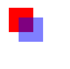
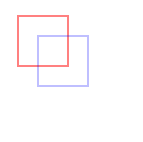

# 动画与Canvas图形

+ 使用`requestAnimationFrame`
+ 理解`<canvas>`元素
+ 绘制简单2D图形
+ 使用WebGL绘制3D图形

图形和动画已经日益成为浏览器中现代Web应用程序的必备功能，但实现起来仍然比较困难。视觉上复杂的功能要求性能调优和硬件加速，不能拖慢浏览器。目前已经有一套日趋完善的API和工具可以用来开发此类功能。

毋庸置疑，`<canvas>`是HTML5最受欢迎的新特性。这个元素会占据一块页面区域，让JavaScript可以动态在上面绘制图片。`<canvas>`最早是苹果公司提出并准备用在控制面板中的，随着其他浏览器的迅速跟进，HTML5将其纳入标准。目前所有主流浏览器都在某种程度上支持`<canvas>`元素。

与浏览器环境中的其他部分一样，`<canvas>`自身提供了一些API，但并非所有浏览器都支持这些API，其中包括支持基础绘图能力的2D上下文和被称为WebGL的3D上下文。支持的浏览器的最新版本现在都支持2D上下文和WebGL。

## 使用`requestAnimationFrame`

这个方法会告诉浏览器要执行动画了，于是浏览器可以通过最优方式确定重绘的时序。

### 早期定时动画

以前，在JavaScript中创建动画基本上就是使用`setInterval()`来控制动画的执行。
```js
(function() {
  function updateAnimations() {
    doAnimation1();
    doAnimation2();
    // 其他任务
  }
  setInterval(updateAnimations, 100);
})();
```
这种定时动画的问题在于无法准确知晓循环之间的延时。定时间隔必须足够短，这样才能让不同的动画类型都能平滑顺畅，但又要足够长，以便产生浏览器可以渲染出来的变化。一般计算机显示器的屏幕刷新率都是60Hz，基本上意味着每秒需要重绘60次。大多数浏览器会限制重绘频率，使其不超出屏幕的刷新率，这是因为超过刷新率，用户也感知不到。

因此，实现平滑动画最佳的重绘间隔为1000毫秒/60，大约17毫秒。以这个速度重绘可以实现最平滑的动画，因为这已经是浏览器的极限了。如果同时运行多个动画，可能需要加以限流，以免17毫秒的重绘间隔过快，导致动画过早运行完。

虽然使用`setInterval()`的定时动画比使用多个`setTimeout()`实现循环效率更高，但也不是没有问题。无论`setInterval()`还是`setTimeout()`都是不能保证时间精度的。

作为第二个参数的延时只能保证何时会把代码添加到浏览器的任务队列，不能保证添加到队列就会立即运行。如果队列前面还有其他任务，那么就要等这些任务执行完再执行。简单来讲，这里毫秒延时并不是说何时这些代码会执行，而只是说到时候会把回调加到任务队列。如果添加到队列后，主线程还被其他任务占用，比如正在处理用户操作，那么回调就不会马上执行。

### 时间间隔的问题

知道何时绘制下一帧是创造平滑动画的关键。直到几年前，都没有办法确切保证何时能让浏览器把下一帧绘制出来。随着`<canvas>`的流行和HTML5游戏的兴起，开发者发现`setInterval()`和`setTimeout()`的不精确是个大问题。

浏览器自身计时器的精度让这个问题雪上加霜。浏览器的计时器精度不足毫秒。以下是几个浏览器计时器的精度情况：

IE8及更早版本的计时器精度为15.625毫秒；

IE9及更晚版本的计时器精度为4毫秒；

Firefox和Safari的计时器精度为约10毫秒；

Chrome的计时器精度为4毫秒。


### `requestAnimationFrame`

`requestAnimationFrame()`方法接收一个参数，此参数是一个要在重绘屏幕前调用的函数。这个函数就是修改DOM样式以反映下一次重绘有什么变化的地方。为了实现动画循环，可以把多个`requestAnimationFrame()`调用串联起来，就像以前使用`setTimeout()`时一样：
```js
function updateProgress() {
  var div = document.getElementById("status");
  div.style.width = (parseInt(div.style.width, 10) + 5) + "%";
  if (div.style.left != "100%") {
  requestAnimationFrame(updateProgress);
  }
}
requestAnimationFrame(updateProgress);
```

因为`requestAnimationFrame()`只会调用一次传入的函数，所以每次更新用户界面时需要再手动调用它一次。同样，也需要控制动画何时停止。结果就会得到非常平滑的动画。

目前为止，`requestAnimationFrame()`已经解决了浏览器不知道JavaScript动画何时开始的问题，以及最佳间隔是多少的问题，但是，不知道自己的代码何时实际执行的问题呢？这个方案同样也给出了解决方法。

传给`requestAnimationFrame()`的函数实际上可以接收一个参数，此参数是一个`DOMHighResTimeStamp`的实例（比如`performance.now()`返回的值），表示下次重绘的时间。这一点非常重要：`requestAnimationFrame()`实际上把重绘任务安排在了未来一个已知的时间点上，而且通过这个参数告诉了开发者。基于这个参数，就可以更好地决定如何调优动画了。


### `cancelAnimationFrame`

与`setTimeout()`类似，`requestAnimationFrame()`也返回一个请求ID，可以用于通过另一个方法`cancelAnimationFrame()`来取消重绘任务。
```js
let requestID = window.requestAnimationFrame(() => {
  console.log('Repaint!');
});
window.cancelAnimationFrame(requestID);
```

### 通过`requestAnimationFrame`节流

滚动事件监听器每次触发都会调用名为`expensiveOperation()`（耗时操作）的函数。当向下滚动网页时，这个事件很快就会被触发并执行成百上千次：
```js
function expensiveOperation() {
  console.log('Invoked at', Date.now());
}

window.addEventListener('scroll', () => {
  expensiveOperation();
});
```

如果想把事件处理程序的调用限制在每次重绘前发生，那么可以像这样下面把它封装到`requestAnimationFrame()`调用中：
```js
function expensiveOperation() {
  console.log('Invoked at', Date.now());
}

window.addEventListener('scroll', () => {
  window.requestAnimationFrame(expensiveOperation);
});
```

这样会把所有回调的执行集中在重绘钩子，但不会过滤掉每次重绘的多余调用。此时，定义一个标志变量，由回调设置其开关状态，就可以将多余的调用屏蔽：
```js
let enqueued = false;

function expensiveOperation() {
  console.log('Invoked at', Date.now());
  enqueued = false;
}

window.addEventListener('scroll', () => {
  if (!enqueued) {
    enqueued = true;
    window.requestAnimationFrame(expensiveOperation);
  }
});
```

因为重绘是非常频繁的操作，所以这还算不上真正的节流。更好的办法是配合使用一个计时器来限制操作执行的频率。这样，计时器可以限制实际的操作执行间隔，而`requestAnimationFrame`控制在浏览器的哪个渲染周期中执行。下面的例子可以将回调限制为不超过50毫秒执行一次：
```js
let enabled = true;

function expensiveOperation() {
  console.log('Invoked at', Date.now());
}

window.addEventListener('scroll', () => {
  if (enabled) {
    enabled = false;
    window.requestAnimationFrame(expensiveOperation);
    window.setTimeout(() => enabled = true, 50);
  }
});
```


## 基本的画布功能

创建`<canvas>`元素时至少要设置其`width`和`height`属性，这样才能告诉浏览器在多大面积上绘图。出现在开始和结束标签之间的内容是后备数据，会在浏览器不支持`<canvas>`元素时显示。
```js
<canvas id="drawing" width="200" height="200">A drawing of something.</canvas>
```
与其他元素一样，`width`和`height`属性也可以在DOM节点上设置，因此可以随时修改。整个元素还可以通过CSS添加样式，并且元素在添加样式或实际绘制内容前是不可见的。


要在画布上绘制图形，首先要取得绘图上下文。使用`getContext()`方法可以获取对绘图上下文的引用。对于平面图形，需要给这个方法传入参数`"2d"`，表示要获取2D上下文对象：
```js
let drawing = document.getElementById("drawing");

// 确保浏览器支持<canvas>
if (drawing.getContext) {

  let context = drawing.getContext("2d");

  // 其他代码
}
```


**可以使用toDataURL()方法导出`<canvas>`元素上的图像。**这个方法接收一个参数： 要生成图像的MIME类型（与用来创建图形的上下文无关）。
```js
let drawing = document.getElementById("drawing");

// 确保浏览器支持<canvas>
if (drawing.getContext) {

  // 取得图像的数据URI
  let imgURI = drawing.toDataURL("image/png");

  // 显示图片
  let image = document.createElement("img");
  image.src = imgURI;
  document.body.appendChild(image);
}
```
浏览器默认将图像编码为PNG格式，除非另行指定。Firefox和Opera还支持传入`"image/jpeg"`进行JPEG编码。因为这个方法是后来才增加到规范中的，所以支持的浏览器也是在后面的版本实现的，包括IE9、Firefox 3.5和Opera 10。

!> 注意　如果画布中的图像是其他域绘制过来的，`toDataURL()`方法就会抛出错误。


## 2D绘图上下文

2D绘图上下文提供了绘制2D图形的方法，包括矩形、弧形和路径。2D上下文的坐标原点(0, 0)在`<canvas>`元素的左上角。所有坐标值都相对于该点计算，因此x坐标向右增长，y坐标向下增长。默认情况下，`width`和`height`表示两个方向上像素的最大值。


### 填充和描边

2D上下文有两个基本绘制操作：填充和描边。填充以指定样式（颜色、渐变或图像）自动填充形状，而描边只为图形边界着色。大多数2D上下文操作有填充和描边的变体，显示效果取决于两个属性：`fillStyle`和`strokeStyle`。

这两个属性可以是字符串、渐变对象或图案对象，默认值都为`"#000000"`。字符串表示颜色值，可以是CSS支持的任意格式：名称、十六进制代码、`rgb`、`rgba`、`hsl`或`hsla`。比如：
```js
let drawing = document.getElementById("drawing");

// 确保浏览器支持<canvas>
if (drawing.getContext) {

  let context = drawing.getContext("2d");
  context.strokeStyle = "red";
  context.fillStyle = "#0000ff";
}
```


### 绘制矩形

矩形是唯一一个可以直接在2D绘图上下文中绘制的形状。与绘制矩形相关的方法有3个：`fillRect()`、`strokeRect()`和`clearRect()`。这些方法都接收4个参数：`矩形x坐标`、`矩形y坐标`、`矩形宽度`和`矩形高度`。这几个参数的单位都是像素。

**`fillRect()`方法用于以指定颜色在画布上绘制并填充矩形。**填充的颜色使用fillStyle属性指定。
```js
let drawing = document.getElementById("drawing");

// 确保浏览器支持<canvas>
if (drawing.getContext) {
  let context = drawing.getContext("2d");

  /*
   * 引自MDN文档
   */

  // 绘制红色矩形
  context.fillStyle = "#ff0000";
  context.fillRect(10, 10, 50, 50);

  // 绘制半透明蓝色矩形
  context.fillStyle = "rgba(0,0,255,0.5)";
  context.fillRect(30, 30, 50, 50);
}
```



**`strokeRect()`方法使用通过`strokeStyle`属性指定的颜色绘制矩形轮廓。**
```js
let drawing = document.getElementById("drawing");

// 确保浏览器支持<canvas>
if (drawing.getContext) {
  let context = drawing.getContext("2d");

  /*
   * 引自MDN文档
   */

  // 绘制红色轮廓的矩形
  context.strokeStyle = "#ff0000";
  context.strokeRect(10, 10, 50, 50);

  // 绘制半透明蓝色轮廓的矩形
  context.strokeStyle = "rgba(0,0,255,0.5)";
  context.strokeRect(30, 30, 50, 50);
}
```


?> 描边宽度由`lineWidth`属性控制，它可以是任意整数值。类似地，`lineCap`属性控制线条端点的形状［`"butt"`（平头）、`"round"`（出圆头）或`"square"`（出方头）］，而`lineJoin`属性控制线条交点的形状［`"round"`（圆转）、`"bevel"`（取平）或`"miter"`（出尖）］。


**使用`clearRect()`方法可以擦除画布中某个区域。**该方法用于把绘图上下文中的某个区域变透明。通过先绘制形状再擦除指定区域，可以创建出有趣的效果，比如从已有矩形中开个孔。
```js
let drawing = document.getElementById("drawing");

// 确保浏览器支持<canvas>
if (drawing.getContext) {
  let context = drawing.getContext("2d");

  /*
   * 引自MDN文档
   */

  // 绘制红色矩形
  context.fillStyle = "#ff0000";
  context.fillRect(10, 10, 50, 50);

  // 绘制半透明蓝色矩形
  context.fillStyle = "rgba(0,0,255,0.5)";
  context.fillRect(30, 30, 50, 50);

  // 在前两个矩形重叠的区域擦除一个矩形区域
  context.clearRect(40, 40, 10, 10);
}
```


### 绘制路径

2D绘图上下文支持很多在画布上绘制路径的方法。通过路径可以创建复杂的形状和线条。

要绘制路径，必须首先调用`beginPath()`方法以表示要开始绘制新路径。然后，再调用下列方法来绘制路径。

+ `arc(x, y, radius, startAngle, endAngle, counterclockwise)`：
  - 以坐标`(x, y)`为圆心，
  - 以`radius`为半径绘制一条弧线，
  - 起始角度为`startAngle`，
  - 结束角度为`endAngle`（都是弧度）。
  - 最后一个参数`counterclockwise`表示是否逆时针计算起始角度和结束角度（默认为顺时针）。

+ `arcTo(x1, y1, x2, y2, radius)`：
  - 以给定半径`radius`，
  - 经由`(x1, y1)`绘制一条从上一点到`(x2, y2)`的弧线。

+ `bezierCurveTo(c1x, c1y, c2x, c2y, x, y)`：
  - 以`(c1x, c1y)`和`(c2x, c2y)`为控制点，
  - 绘制一条从上一点到`(x, y)`的弧线（三次贝塞尔曲线）。

+ `lineTo(x, y)`：
  - 绘制一条从上一点到`(x, y)`的直线。

+ `moveTo(x, y)`：
  - 不绘制线条，只把绘制光标移动到`(x, y)`。

+ `quadraticCurveTo(cx, cy, x, y)`：
  - 以`(cx, cy)`为控制点，
  - 绘制一条从上一点到`(x, y)`的弧线（二次贝塞尔曲线）。

+ `rect(x, y, width, height)`：
  - 以给定宽度和高度在坐标点`(x, y)`绘制一个矩形。
  - 这个方法与`strokeRect()`和`fillRect()`的区别在于，它创建的是一条路径，而不是独立的图形。

创建路径之后，可以使用`closePath()`方法绘制一条返回起点的线。

如果路径已经完成，则既可以指定`fillStyle`属性并调用`fill()`方法来填充路径，也可以指定`strokeStyle`属性并调用`stroke()`方法来描画路径，还可以调用`clip()`方法基于已有路径创建一个新剪切区域。


下面这个例子使用前面提到的方法绘制了一个不带数字的表盘：
```js
let drawing = document.getElementById("drawing");

// 确保浏览器支持<canvas>
if (drawing.getContext) {
  let context = drawing.getContext("2d");

  // 创建路径
  context.beginPath();

  // 绘制外圆
  context.arc(100, 100, 99, 0, 2 * Math.PI, false);

  // 绘制内圆
  context.moveTo(194, 100);
  context.arc(100, 100, 94, 0, 2 * Math.PI, false);

  // 绘制分针
  context.moveTo(100, 100);
  context.lineTo(100, 15);

  // 绘制时针
  context.moveTo(100, 100);
  context.lineTo(35, 100);

  // 描画路径
  context.stroke();
}
```


路径是2D上下文的主要绘制机制，为绘制结果提供了很多控制。因为路径经常被使用，所以也有一个`isPointInPath()`方法，接收x轴和y轴坐标作为参数。这个方法用于确定指定的点是否在路径上，可以在关闭路径前随时调用，比如：
```js
if (context.isPointInPath(100, 100)) {
  alert("Point (100, 100) is in the path.");
}
```


### 绘制文本

文本和图像混合也是常见的绘制需求，因此2D绘图上下文还提供了绘制文本的方法，即`fillText()`和`strokeText()`。这两个方法都接收4个参数：`要绘制的字符串`、`x坐标`、`y坐标`和`可选的最大像素宽度`。而且，这两个方法最终绘制的结果都取决于以下3个属性。

+ `font`：以CSS语法指定的字体样式、大小、字体族等，比如`"10px Arial"`。
+ `textAlign`：
  - 指定文本的对齐方式，可能的值包括`"start"`、`"end"`、`"left"`、`"right"`和`"center"`。
  - 推荐使用`"start"`和`"end"`，不使用`"left"`和`"right"`，因为前者无论在从左到右书写的语言还是从右到左书写的语言中含义都更明确。
+ `textBaseLine`：指定文本的基线，可能的值包括`"top"`、`"hanging"`、`"middle"`、`"alphabetic"`、`"ideographic"`和`"bottom"`。

这些属性都有相应的默认值，因此没必要每次绘制文本时都设置它们。`fillText()`方法使用`fillStyle`属性绘制文本，而`strokeText()`方法使用`strokeStyle`属性。通常，`fillText()`方法是使用最多的，因为它模拟了在网页中渲染文本。

例如，下面的例子会在前一节示例的表盘顶部绘制数字“12”：
```js
context.font = "bold 14px Arial";
context.textAlign = "center";
context.textBaseline = "middle";
context.fillText("12", 100, 20);
```


因为把`textAlign`设置为了`"center"`，把`textBaseline`设置为了`"middle"`，所以(100, 20)表示文本水平和垂直中心点的坐标。如果`textAlign`是`"start"`，那么x坐标在从左到右书写的语言中表示文本的左侧坐标，而`"end"`会让x坐标在从左到右书写的语言中表示文本的右侧坐标。例如：
```js
// 正常
context.font = "bold 14px Arial";
context.textAlign = "center";
context.textBaseline = "middle";
context.fillText("12", 100, 20);
// 与开头对齐
context.textAlign = "start";
context.fillText("12", 100, 40);
// 与末尾对齐
context.textAlign = "end";
context.fillText("12", 100, 60);
```


因为表盘中垂直的线条是居中的，所以文本的对齐方式就一目了然了。类似地，通过修改`textBaseline`属性，可以改变文本的垂直对齐方式。比如，设置为`"top"`意味着y坐标表示文本顶部，`"bottom"`表示文本底部，`"hanging"`、`"alphabetic"`和`"ideographic"`分别引用字体中特定的基准点。

由于绘制文本很复杂，特别是想把文本绘制到特定区域的时候，因此2D上下文提供了用于辅助确定文本大小的`measureText()`方法。这个方法接收一个参数，即要绘制的文本，然后返回一个`TextMetrics`对象。这个返回的对象目前只有一个属性`width`，不过将来应该会增加更多度量指标。

`fillText()`和`strokeText()`方法还有第四个参数，即文本的最大宽度。这个参数是可选的（Firefox 4是第一个实现它的浏览器），如果调用`fillText()`和`strokeText()`时提供了此参数，但要绘制的字符串超出了最大宽度限制，则文本会以正确的字符高度绘制，这时字符会被水平压缩，以达到限定宽度。

### 变换

上下文变换可以操作绘制在画布上的图像。2D绘图上下文支持所有常见的绘制变换。在创建绘制上下文时，会以默认值初始化变换矩阵，从而让绘制操作如实应用到绘制结果上。对绘制上下文应用变换，可以导致以不同的变换矩阵应用绘制操作，从而产生不同的结果。

+ `rotate(angle)`：围绕原点把图像旋转`angle`弧度。
+ `scale(scaleX, scaleY)`：通过在x轴乘以`scaleX`、在y轴乘以`scaleY`来缩放图像。`scaleX`和`scaleY`的默认值都是1.0。
+ `translate(x, y)`：把原点移动到`(x, y)`。执行这个操作后，坐标(0, 0)就会变成`(x, y)`。
+ `transform(m1_1, m1_2, m2_1, m2_2, dx, dy)`：像下面这样通过矩阵乘法直接修改矩阵。
```js
m1_1 m1_2 dx
m2_1 m2_2 dy
0    0    1
```
+ `setTransform(m1_1, m1_2, m2_1, m2_2, dx, dy)`：把矩阵重置为默认值，再以传入的参数调用`transform()`。

把原点移动到(100, 100)，也就是表盘的中心后，要绘制表针只需简单的数学计算即可。这是因为所有计算都是基于(0, 0)，而不是(100, 100)了。当然，也可以使用`rotate()`方法来转动表针：
```js
let drawing = document.getElementById("drawing");

// 确保浏览器支持<canvas>
if (drawing.getContext) {
  let context = drawing.getContext("2d");

  // 创建路径
  context.beginPath();

  // 绘制外圆
  context.arc(100, 100, 99, 0, 2 * Math.PI, false);

  // 绘制内圆
  context.moveTo(194, 100);
  context.arc(100, 100, 94, 0, 2 * Math.PI, false);

  // 移动原点到表盘中心
  context.translate(100, 100);

  // 旋转表针
  context.rotate(1);

  // 绘制分针
  context.moveTo(0, 0);
  context.lineTo(0, -85);

  // 绘制时针
  context.moveTo(0, 0);
  context.lineTo(-65, 0);

  // 描画路径
  context.stroke();
}
```


所有这些变换，包括`fillStyle`和`strokeStyle`属性，会一直保留在上下文中，直到再次修改它们。虽然没有办法明确地将所有值都重置为默认值，但有两个方法可以帮我们跟踪变化。如果想着什么时候再回到当前的属性和变换状态，可以调用`save()`方法。调用这个方法后，所有这一时刻的设置会被放到一个暂存栈中。保存之后，可以继续修改上下文。而在需要恢复之前的上下文时，可以调用`restore()`方法。这个方法会从暂存栈中取出并恢复之前保存的设置。多次调用`save()`方法可以在暂存栈中存储多套设置，然后通过`restore()`可以系统地恢复。
```js
context.fillStyle = "#ff0000";
context.save();

context.fillStyle = "#00ff00";
context.translate(100, 100);
context.save();

context.fillStyle = "#0000ff";
context.fillRect(0, 0, 100, 200);     // 在(100, 100)绘制蓝色矩形

context.restore();
context.fillRect(10, 10, 100, 200);   // 在(100, 100)绘制绿色矩形

context.restore();
context.fillRect(0, 0, 100, 200);     // 在(0, 0)绘制红色矩形
```
注意，`save()`方法只保存应用到绘图上下文的设置和变换，不保存绘图上下文的内容。


### 绘制图像

2D绘图上下文内置支持操作图像。如果想把现有图像绘制到画布上，可以使用`drawImage()`方法。这个方法可以接收3组不同的参数，并产生不同的结果。最简单的调用是传入一个HTML的``元素，以及表示绘制目标的x和y坐标，结果是把图像绘制到指定位置。

事例代码获取了文本中的第一个图像，然后在画布上的坐标(10, 10)处将它绘制了出来。
```js
let image = document.images[0];
context.drawImage(image, 10, 10);
```

绘制出来的图像与原来的图像一样大。如果想改变所绘制图像的大小，可以再传入另外两个参数：目标宽度和目标高度。这里的缩放只影响绘制的图像，不影响上下文的变换矩阵。
```js
context.drawImage(image, 50, 10, 20, 30);
```

还可以只把图像的一个区域绘制到上下文中。此时，需要给`drawImage()`提供9个参数：`要绘制的图像`、`源图像x坐标`、`源图像y坐标`、`源图像宽度`、`源图像高度`、`目标区域x坐标`、`目标区域y坐标`、`目标区域宽度`和`目标区域高度`。这个重载后的`drawImage()`方法可以实现最大限度的控制:
```js
context.drawImage(image, 0, 10, 50, 50, 0, 100, 40, 60);
```
最终，原始图像中只有一部分会绘制到画布上。这一部分从(0, 10)开始，50像素宽、50像素高。而绘制到画布上时，会从(0, 100)开始，变成40像素宽、60像素高。

第一个参数除了可以是HTML的``元素，还可以是另一个`<canvas>`元素，这样就会把另一个画布的内容绘制到当前画布上。

结合其他一些方法，`drawImage()`方法可以方便地实现常见的图像操作。操作的结果可以使用`toDataURL()`方法获取。不过有一种情况例外：如果绘制的图像来自其他域而非当前页面，则不能获取其数据。此时，调用`toDataURL()`将抛出错误。比如，如果来自www.example.com的页面上绘制的是来自www.wrox.com的图像，则上下文就是“脏的”，获取数据时会抛出错误。


#### 扩展：微信小程序`drawImage`

**CanvasContext.drawImage(string imageResource, number sx, number sy, number sWidth, number sHeight, number dx, number dy, number dWidth, number dHeight)**

参数   
**string imageResource**   
所要绘制的图片资源（网络图片要通过 getImageInfo / downloadFile 先下载）

**number sx**  
需要绘制到画布中的，imageResource的矩形（裁剪）选择框的左上角 x 坐标

**number sy**  
需要绘制到画布中的，imageResource的矩形（裁剪）选择框的左上角 y 坐标

**number sWidth**  
需要绘制到画布中的，imageResource的矩形（裁剪）选择框的宽度

**number sHeight**   
需要绘制到画布中的，imageResource的矩形（裁剪）选择框的高度

**number dx**  
imageResource的左上角在目标 canvas 上 x 轴的位置

**number dy**  
imageResource的左上角在目标 canvas 上 y 轴的位置

**number dWidth**  
在目标画布上绘制imageResource的宽度，允许对绘制的imageResource进行缩放

**number dHeight**   
在目标画布上绘制imageResource的高度，允许对绘制的imageResource进行缩放

有三个版本的写法：

+ drawImage(imageResource, dx, dy)
+ drawImage(imageResource, dx, dy, dWidth, dHeight)
+ drawImage(imageResource, sx, sy, sWidth, sHeight, dx, dy, dWidth, dHeight) 从 1.9.0 起支持

[微信小程序官方文档--画布--CanvasContext.drawImage](https://developers.weixin.qq.com/miniprogram/dev/api/canvas/CanvasContext.drawImage.html)

### 阴影

2D上下文可以根据以下属性的值自动为已有形状或路径生成阴影。

+ `shadowColor`：CSS颜色值，表示要绘制的阴影颜色，默认为黑色。
+ `shadowOffsetX`：阴影相对于形状或路径的x坐标的偏移量，默认为0。
+ `shadowOffsetY`：阴影相对于形状或路径的y坐标的偏移量，默认为0。
+ `shadowBlur`：像素，表示阴影的模糊量。默认值为0，表示不模糊。

事例：
```js
let context = drawing.getContext("2d");
// 设置阴影
context.shadowOffsetX = 5;
context.shadowOffsetY = 5;
context.shadowBlur  = 4;
context.shadowColor   = "rgba(0, 0, 0, 0.5)";
// 绘制红色矩形
context.fillStyle = "#ff0000";
context.fillRect(10, 10, 50, 50);
// 绘制蓝色矩形
context.fillStyle = "rgba(0,0,255,1)";
context.fillRect(30, 30, 50, 50);
```


### 渐变

渐变通过`CanvasGradient`的实例表示，在2D上下文中创建和修改都非常简单。要创建一个新的线性渐变，可以调用上下文的`createLinearGradient()`方法。这个方法接收4个参数：`起点x坐标`、`起点y坐标`、`终点x坐标`和`终点y坐标`。调用之后，该方法会以指定大小创建一个新的`CanvasGradient`对象并返回实例。

有了`gradient`对象后，接下来要使用`addColorStop()`方法为渐变指定色标。这个方法接收两个参数：`色标位置`和`CSS颜色字符串`。色标位置通过0～1范围内的值表示，0是第一种颜色，1是最后一种颜色。

```js
let gradient = context.createLinearGradient(30, 30, 70, 70);
gradient.addColorStop(0, "white");
gradient.addColorStop(1, "black");
```

这个`gradient`对象现在表示的就是在画布上从(30, 30)到(70, 70)绘制一个渐变。渐变的起点颜色为白色，终点颜色为黑色。可以把这个对象赋给`fillStyle`或`strokeStyle`属性，从而以渐变填充或描画绘制的图形:
```js
let gradient = context.createLinearGradient(30, 30, 70, 70);
gradient.addColorStop(0, "white");
gradient.addColorStop(1, "black");

// 绘制红色矩形
context.fillStyle = "#ff0000";
context.fillRect(10, 10, 50, 50);
// 绘制渐变矩形
context.fillStyle = gradient;
context.fillRect(30, 30, 50, 50);
```


如果矩形没有绘制到渐变的范围内，则只会显示部分渐变。  
```js
context.fillStyle = gradient;
context.fillRect(50, 50, 50, 50);
```


**径向渐变（或放射性渐变）要使用`createRadialGradient()`方法来创建。**

这个方法接收6个参数，分别对应两个圆形圆心的坐标和半径。前3个参数指定`起点圆形中心`的`x`、`y`坐标和`半径`，后3个参数指定`终点圆形中心`的`x`、`y`坐标和`半径`。在创建径向渐变时，可以把两个圆形想象成一个圆柱体的两个圆形表面。把一个表面定义得小一点，另一个定义得大一点，就会得到一个圆锥体。然后，通过移动两个圆形的圆心，就可以旋转这个圆锥体。

要创建起点圆心在形状中心并向外扩散的径向渐变，需要将两个圆形设置为同心圆。比如，要在前面例子中矩形的中心创建径向渐变，则渐变的两个圆形的圆心都必须设置为(55, 55)。这是因为矩形的起点是(30, 30)，终点是(80, 80)。
```js
let gradient = context.createRadialGradient(55, 55, 10, 55, 55, 30);
gradient.addColorStop(0, "white");
gradient.addColorStop(1, "black");
// 绘制红色矩形
context.fillStyle = "#ff0000";
context.fillRect(10, 10, 50, 50);
// 绘制渐变矩形
context.fillStyle = gradient;
context.fillRect(30, 30, 50, 50);
```


### 图案

图案是用于填充和描画图形的重复图像。要创建新图案，可以调用`createPattern()`方法并传入两个参数：一个HTML ``元素和一个表示该如何重复图像的字符串。第二个参数的值与CSS的`background-repeat`属性是一样的，包括`"repeat"`、`"repeat-x"`、`"repeat-y"`和`"no-repeat"`。
```js
let image = document.images[0],
  pattern = context.createPattern(image, "repeat");
// 绘制矩形
context.fillStyle = pattern;
context.fillRect(10, 10, 150, 150);
```

!> 图案的起点实际上是画布的原点(0, 0)。将填充样式设置为图案，表示在指定位置而不是开始绘制的位置显示图案。

!> 出现黑屏情况是图片资源没加载就绘制了，可`window.addEventListener`的`load`或`Image.addEventListener`的`onload`监听图片加载完再绘制

传给`createPattern()`方法的第一个参数也可以是`<video>`元素或者另一个`<canvas>`元素。

### 图像数据

2D上下文中比较强大的一种能力是可以使用`getImageData()`方法获取原始图像数据。这个方法接收4个参数：要取得数据中第一个像素的`左上角坐标(x,y)`和要取得的像素`宽度及高度(w,h)`。

例如，要从(10, 5)开始取得50像素宽、50像素高的区域对应的数据:
```js
let imageData = context.getImageData(10, 5, 50, 50);
```

返回的对象是一个`ImageData`的实例。每个`ImageData`对象都包含3个属性：`width`、`height`和`data`，其中，`data`属性是包含图像的原始像素信息的数组。每个像素在`data`数组中都由4个值表示，分别代表红、绿、蓝和透明度值。换句话说，第一个像素的信息包含在第0到第3个值中，比如：
```js
let data = imageData.data,
  red = data[0],
  green = data[1],
  blue = data[2],
  alpha = data[3];
```

这个数组中的每个值都在0~255范围内（包括0和255）。对原始图像数据进行访问可以更灵活地操作图像。例如，通过更改图像数据可以创建一个简单的灰阶过滤器：
```js
let drawing = document.getElementById("drawing");
// 确保浏览器支持<canvas>
if (drawing.getContext) {
  let context = drawing.getContext("2d"),
    image = document.images[0],
    imageData, data,
    i, len, average,
    red, green, blue, alpha;

  // 绘制图像
  context.drawImage(image, 0, 0);

  // 取得图像数据
  imageData = context.getImageData(0, 0, image.width, image.height);
  data = imageData.data;
  for (i=0, len=data.length; i < len; i+=4) {

    red = data[i];
    green = data[i+1];
    blue = data[i+2];
    alpha = data[i+3];

    // 取得RGB平均值
    average = Math.floor((red + green + blue) / 3);

    // 设置颜色，不管透明度
    data[i] = average;
    data[i+1] = average;
    data[i+2] = average;

  }

  // 将修改后的数据写回ImageData并应用到画布上显示出来
  imageData.data = data;
  context.putImageData(imageData, 0, 0);
}
```
这个例子首先在画布上绘制了一个图像，然后又取得了其图像数据。for循环遍历了图像数据中的每个像素，注意每次循环都要给i加上4。每次循环中取得红、绿、蓝的颜色值，计算出它们的平均值。然后再把原来的值修改为这个平均值，实际上相当于过滤掉了颜色信息，只留下类似亮度的灰度信息。之后将`data`数组重写回`imageData`对象。最后调用`putImageData()`方法，把图像数据再绘制到画布上。结果就得到了原始图像的黑白版。

当然，灰阶过滤只是基于原始像素值可以实现的其中一种操作。要了解基于原始图像数据还可以实现哪些操作，可以参考Ilmari Heikkinen的文章“Making Image Filters with Canvas”。

!> 注意　只有在画布没有加载跨域内容时才可以获取图像数据。如果画布上绘制的是跨域内容，则尝试获取图像数据会导致JavaScript报错。

### 合成

2D上下文中绘制的所有内容都会应用两个属性：`globalAlpha`和`globalComposition Operation`，其中，`globalAlpha`属性是一个范围在0~1的值（包括0和1），用于指定所有绘制内容的透明度，默认值为0。如果所有后来的绘制都需要使用同样的透明度，那么可以将`globalAlpha`设置为适当的值，执行绘制，然后再把`globalAlpha`设置为0。
```js
// 绘制红色矩形
context.fillStyle = "#ff0000";
context.fillRect(10, 10, 50, 50);
// 修改全局透明度
context.globalAlpha = 0.5;
// 绘制蓝色矩形
context.fillStyle = "rgba(0,0,255,1)";
context.fillRect(30, 30, 50, 50);
// 重置
context.globalAlpha = 0;
```


**`globalCompositionOperation`属性表示新绘制的形状如何与上下文中已有的形状融合。**这个属性是一个字符串，可以取下列值。

+ `source-over`：默认值，新图形绘制在原有图形上面。
+ `source-in`：新图形只绘制出与原有图形重叠的部分，画布上其余部分全部透明。
+ `source-out`：新图形只绘制出不与原有图形重叠的部分，画布上其余部分全部透明。
+ `source-atop`：新图形只绘制出与原有图形重叠的部分，原有图形不受影响。
+ `destination-over`：新图形绘制在原有图形下面，重叠部分只有原图形透明像素下的部分可见。
+ `destination-in`：新图形绘制在原有图形下面，画布上只剩下二者重叠的部分，其余部分完全透明。
+ `destination-out`：新图形与原有图形重叠的部分完全透明，原图形其余部分不受影响。
+ `destination-atop`：新图形绘制在原有图形下面，原有图形与新图形不重叠的部分完全透明。
+ `lighter`：新图形与原有图形重叠部分的像素值相加，使该部分变亮。
+ `copy`：新图形将擦除并完全取代原有图形。
+ `xor`：新图形与原有图形重叠部分的像素执行“异或”计算。

```js
// 绘制红色矩形
context.fillStyle = "#ff0000";
context.fillRect(10, 10, 50, 50);
// 设置合成方式
context.globalCompositeOperation = "destination-over";
// 绘制蓝色矩形
context.fillStyle = "rgba(0,0,255,1)";
context.fillRect(30, 30, 50, 50);
```


+ 示例
  + `source-over`：

  

  + `source-in`：

  

  + `source-out`：

  

  + `source-atop`：

  

  + `destination-over`：

  

  + `destination-in`:

  

  + `destination-out`:

  

  + `destination-atop`:

  

  + `lighter`:

  

  + `copy`:

  

  + `xor`:

  


> 使用`globalCompositeOperation`属性时，一定记得要在不同浏览器上进行测试。不同浏览器在实现这些选项时可能存在差异。这些操作在Safari和Chrome中仍然有些问题，可以参考MDN文档上的`CanvasRenderingContext2D.globalCompositeOperation`，比较它们与IE或Firefox渲染的差异。


## WebGL(不懂)

WebGL是画布的3D上下文。与其他Web技术不同，WebGL不是W3C制定的标准，而是Khronos Group的标准。根据官网描述，“Khronos Group是非营利性、会员资助的联盟，专注于多平台和设备下并行计算、图形和动态媒体的无专利费开放标准”。Khronos Group也制定了其他图形API，包括作为浏览器中WebGL基础的OpenGL ES 2.0。

以了解OpenGL ES 2.0的基本概念为前提，简单介绍OpenGL ES 2.0在WebGL中实现的部分。

要了解关于OpenGL的更多信息，可以访问OpenGL网站或Learn WebGL教程网站。

?> 注意　定型数组是在WebGL中执行操作的重要数据结构。

### WebGL上下文

在完全支持的浏览器中，WebGL 2.0上下文的名字叫`"webgl2"`，WebGL 1.0上下文的名字叫`"webgl1"`。如果浏览器不支持WebGL，则尝试访问WebGL上下文会返回`null`。在使用上下文之前，应该先检测返回值是否存在：
```js
let drawing = document.getElementById("drawing");

// 确保浏览器支持<canvas>
if (drawing.getContext) {
  let gl = drawing.getContext("webgl");
  if (gl){
    // 使用WebGL
  }
}
```
这里把WebGL context对象命名为gl。大多数WebGL应用和例子遵循这个约定，因为OpenGL ES 2.0方法和值通常以"gl"开头。这样可以让JavaScript代码看起来更接近OpenGL程序。

### WebGL基础

取得WebGL上下文后，就可以开始3D绘图了。因为WebGL是OpenGL ES 2.0的Web版，所以本实际上是JavaScript所实现的OpenGL概念。

可以在调用`getContext()`取得WebGL上下文时指定一些选项。这些选项通过一个参数对象传入，选项就是参数对象的一个或多个属性。

+ `alpha`：布尔值，表示是否为上下文创建透明通道缓冲区，默认为true。
+ `depth`：布尔值，表示是否使用16位深缓冲区，默认为true。
+ `stencil`：布尔值，表示是否使用8位模板缓冲区，默认为false。
+ `antialias`：布尔值，表示是否使用默认机制执行抗锯齿操作，默认为true。
+ `premultipliedAlpha`：布尔值，表示绘图缓冲区是否预乘透明度值，默认为true。
+ `preserveDrawingBuffer`：布尔值，表示绘图完成后是否保留绘图缓冲区，默认为false。建议在充分了解这个选项的作用后再自行修改，因为这可能会影响性能。

```js
let drawing = document.getElementById("drawing");

// 确保浏览器支持<canvas>
if (drawing.getContext) {

  let gl = drawing.getContext("webgl", { alpha: false });
  if (gl) {
    // 使用WebGL
  }
}
```
这些上下文选项大部分适合开发高级功能。多数情况下，默认值就可以满足要求。


如果调用getContext()不能创建WebGL上下文，某些浏览器就会抛出错误。为此，最好把这个方法调用包装在try/catch块中：
```js
let drawing = document.getElementById("drawing"),
    gl;

// 确保浏览器支持<canvas>
if (drawing.getContext) {
  try {
    gl = drawing.getContext("webgl");
  } catch (ex) {
    // 什么也不做
  }
  if (gl) {
    // 使用WebGL
  } else {
    alert("WebGL context could not be created.");
  }
}
```


#### 常量

如果你熟悉OpenGL，那么可能知道用于操作的各种常量。这些常量在OpenGL中的名字以`GL_`开头。在WebGL中，`context`对象上的常量则不包含`GL_`前缀。例如，`GL_COLOR_BUFFER_BIT`常量在WebGL中要这样访问`gl.COLOR_BUFFER_BIT`。WebGL以这种方式支持大部分OpenGL常量（少数常量不支持）。


#### 方法命名

OpenGL（同时也是WebGL）中的很多方法会包含相关的数据类型信息。接收不同类型和不同数量参数的方法，会通过方法名的后缀体现这些信息。表示参数数量的数字（1~4）在先，表示数据类型的字符串（“f”表示浮点数，“i”表示整数）在后。比如，`gl.uniform4f()`的意思是需要4个浮点数值参数，而`gl.uniform3i()`表示需要3个整数值参数。

还有很多方法接收数组，这类方法用字母“v”（vector）来表示。因此，`gl.uniform3iv()`就是要接收一个包含3个值的数组参数。在编写WebGL代码时，要记住这些约定。


#### 准备绘图 

准备使用WebGL上下文之前，通常需要先指定一种实心颜色清除`<canvas>`。为此，要调用clearColor()方法并传入4个参数，分别表示红、绿、蓝和透明度值。每个参数必须是0~1范围内的值，表示各个组件在最终颜色的强度。
```js
gl.clearColor(0, 0, 0, 1);  // 黑色
gl.clear(gl.COLOR_BUFFER_BIT);
```
以上代码把清理颜色缓冲区的值设置为黑色，然后调用clear()方法，这个方法相当于OpenGL中的glClear()方法。参数gl.COLOR_BUFFER_BIT告诉WebGL使用之前定义的颜色填充画布。通常，所有绘图操作之前都需要先清除绘制区域。

#### 视口与坐标

**绘图前还要定义WebGL视口。**默认情况下，视口使用整个`<canvas>`区域。要改变视口，可以调用viewport()方法并传入视口相对于`<canvas>`元素的`x`、`y`坐标及宽度和高度。例如，以下代码表示要使用整个`<canvas>`元素：
```js
gl.viewport(0, 0, drawing.width,drawing.height);
```

这个视口的坐标系统与网页中通常的坐标系统不一样。视口的x和y坐标起点(0, 0)表示`<canvas>`元素的左下角，向上、向右增长可以用点(width–1, height–1)定义。


**只使用`<canvas>`元素的一部分来绘图**
```js
// 视口是<canvas> 左下角四分之一区域
gl.viewport(0, 0, drawing.width/2, drawing.height/2);
// 视口是<canvas> 左上角四分之一区域
gl.viewport(0, drawing.height/2, drawing.width/2, drawing.height/2);
// 视口是<canvas> 右下角四分之一区域
gl.viewport(drawing.width/2, 0, drawing.width/2, drawing.height/2);
```


定义视口的坐标系统与视口中的坐标系统不一样。在视口中，坐标原点(0, 0)是视口的中心点。左下角是(–1, –1)，右上角是(1, 1)


如果绘图时使用了视口外部的坐标，则绘制结果会被视口剪切。例如，要绘制的形状有一个顶点在(1, 2)，则视口右侧的图形会被切掉。


#### 缓冲区

在JavaScript中，顶点信息保存在定型数组中。要使用这些信息，必须先把它们转换为`WebGL缓冲区。创建缓冲区要调用`gl.createBuffer()`方法，并使用`gl.bindBuffer()`方法将缓冲区绑定到WebGL上下文。绑定之后，就可以用数据填充缓冲区了。
```js
let buffer = gl.createBuffer();
gl.bindBuffer(gl.ARRAY_BUFFER, buffer);
gl.bufferData(gl.ARRAY_BUFFER, new Float32Array([0, 0.5, 1]), gl.STATIC_DRAW);
```
调用`gl.bindBuffer()`将`buffer`设置为上下文的当前缓冲区。然后，所有缓冲区操作都在`buffer`上直接执行。因此，调用`gl.bufferData()`虽然没有包含对`buffer`的直接引用，但仍然是在它上面执行的。上面最后一行代码使用一个`Float32Array`（通常把所有顶点信息保存在`Float32Array`中）初始化了`buffer`。如果想输出缓冲区内容，那么可以调用`drawElements()`方法并传入`gl.ELEMENT_ARRAY_BUFFER`。


`gl.bufferData()`方法的最后一个参数表示如何使用缓冲区。这个参数可以是以下常量值。

+ `gl.STATIC_DRAW`：数据加载一次，可以在多次绘制中使用。
+ `gl.STREAM_DRAW`：数据加载一次，只能在几次绘制中使用。
+ `gl.DYNAMIC_DRAW`：数据可以重复修改，在多次绘制中使用

> 除非是很有经验的OpenGL程序员，否则我们会对大多数缓冲区使用`gl.STATIC_DRAW`。

缓冲区会一直驻留在内存中，直到页面卸载。如果不再需要缓冲区，那么最好**调用`gl.deleteBuffer()`方法释放其占用的内存**：
```js
gl.deleteBuffer(buffer);
```


#### 错误

与JavaScript多数情况下不同的是，在WebGL操作中通常不会抛出错误。必须在调用可能失败的方法后，调用`gl.getError()`方法。这个方法返回一个常量，表示发生的错误类型。下面列出了这些常量。

+ `gl.NO_ERROR`：上一次操作没有发生错误（0值）。
+ `gl.INVALID_ENUM`：上一次操作没有传入WebGL预定义的常量。
+ `gl.INVALID_VALUE`：上一次操作需要无符号数值，但是传入了负数。
+ `gl.INVALID_OPERATION`：上一次操作在当前状态下无法完成。
+ `gl.OUT_OF_MEMORY`：上一次操作因内存不足而无法完成。
+ `gl.CONTEXT_LOST_WEBGL`：上一次操作因外部事件（如设备掉电）而丢失了WebGL上下文。

每次调用`gl.getError()`方法会返回一个错误值。第一次调用之后，再调用`gl.getError()`可能会返回另一个错误值。如果有多个错误，则可以重复这个过程，直到`gl.getError()`返回`gl.NO_ERROR`。如果执行了多次操作，那么可以通过循环调用`getError()`：
```js
let errorCode = gl.getError();
while (errorCode) {
  console.log("Error occurred: " + errorCode);
  errorCode = gl.getError();
}
```


#### 着色器

着色器是OpenGL中的另一个概念。WebGL中有两种着色器：`顶点着色器`和`片段（或像素）着色器`。**顶点着色器用于把3D顶点转换为可以渲染的2D点。片段着色器用于计算绘制一个像素的正确颜色。**WebGL着色器的独特之处在于，它们不是JavaScript实现的，而是使用一种与C或JavaScript完全不同的语言GLSL（OpenGL Shading Language）写的。


#### 编写着色器

GLSL是一种类似于C的语言，专门用于编写OpenGL着色器。因为WebGL是OpenGL ES 2的实现，所以OpenGL中的着色器可以直接在WebGL中使用。这样也可以让桌面应用更方便地移植到Web上。

每个着色器都有一个`main()`方法，在绘制期间会重复执行。给着色器传递数据的方式有两种：`attribute`和`uniform`。

+ `attribute`用于将`顶点`传入顶点着色器
+ `uniform`用于将`常量值`传入任何着色器。

`attribute`和`uniform`是在`main()`函数外部定义的。在值类型关键字之后是数据类型，然后是变量名。

下面是一个简单的顶点着色器的例子：
```js
// OpenGL着色器语言
// 着色器，摘自Bartek Drozdz的文章“Get started with WebGL—draw a square”
attribute vec2 aVertexPosition;

void main() {
  gl_Position = vec4(aVertexPosition, 0.0, 1.0);
}
```
这个顶点着色器定义了一个名为`aVertexPosition`的`attribute`。这个`attribute`是一个包含两项的数组（数据类型为`vec2`），代表x和y坐标。即使只传入了两个坐标，顶点着色器返回的值也会包含4个元素，保存在变量`gl_Position`中。这个着色器创建了一个新的包含4项的数组（`vec4`），缺少的坐标会补充上，实际上是把2D坐标转换为了3D坐标。


片段着色器与顶点着色器类似，只不过是通过`uniform`传入数据。
```js
// OpenGL着色器语言
// 着色器，摘自Bartek Drozdz的文章“Get started with WebGL—draw a square”
uniform vec4 uColor;

void main() {
  gl_FragColor = uColor;
}
```
片段着色器必须返回一个值，保存到变量`gl_FragColor`中，这个值表示绘制时使用的颜色。这个着色器定义了一个`uniform`，包含颜色的4个组件（`vec4`），保存在`uColor`中。从代码上看，这个着色器只是把传入的值赋给了`gl_FragColor`。`uColor`的值在着色器内不能改变。

!> 注意　OpenGL着色器语言比示例中的代码要复杂，此只是从使用WebGL的角度对这门语言做个极其简单的介绍。要了解更多信息，可以参考Randi J. Rost的著作《OpenGL着色语言》。


#### 创建着色器程序

浏览器并不理解原生GLSL代码，因此GLSL代码的字符串必须经过编译并链接到一个着色器程序中。为便于使用，通常可以使用带有自定义`type`属性的`<script>`元素把着色器代码包含在网页中。如果`type`属性无效，则浏览器不会解析`<script>`的内容，但这并不妨碍读写其中的内容：
```js
<script type="x-webgl/x-vertex-shader" id="vertexShader">
attribute vec2 aVertexPosition;

void main() {
  gl_Position = vec4(aVertexPosition, 0.0, 1.0);
}
</script>
<script type="x-webgl/x-fragment-shader" id="fragmentShader">
uniform vec4 uColor;

void main() {
  gl_FragColor = uColor;
}
</script>
```

可以使用`text`属性提取`<script>`元素的内容:
```js
let vertexGlsl = document.getElementById("vertexShader").text,
    fragmentGlsl = document.getElementById("fragmentShader").text;
```

#### 绘图

WebGL只能绘制三种形状：`点`、`线`和`三角形`。其他形状必须通过这三种基本形状在3D空间的组合来绘制。

WebGL绘图要使用`drawArrays()`和`drawElements()`方法，前者使用数组缓冲区，后者则操作元素数组缓冲区。

`drawArrays()`和`drawElements()`的第一个参数都表示要绘制形状的常量。下面列出了这些常量。

+ `gl.POINTS`：
  - 将每个顶点当成一个点来绘制。

+ `gl.LINES`：
  - 将数组作为一系列顶点，在这些顶点间绘制直线。每个顶点既是起点也是终点，因此数组中的顶点必须是偶数个才能开始绘制。

+ `gl.LINE_LOOP`：
  - 将数组作为一系列顶点，在这些顶点间绘制直线。从第一个顶点到第二个顶点绘制一条直线，再从第二个顶点到第三个顶点绘制一条直线，以此类推，直到绘制到最后一个顶点。
  - 此时再从最后一个顶点到第一个顶点绘制一条直线。这样就可以绘制出形状的轮廓。

+ `gl.LINE_STRIP`：
  - 类似于`gl.LINE_LOOP`，区别在于不会从最后一个顶点到第一个顶点绘制直线。

+ `gl.TRIANGLES`：
  - 将数组作为一系列顶点，在这些顶点间绘制三角形。如不特殊指定，每个三角形都分开绘制，不共享顶点。

+ `gl.TRIANGLES_STRIP`：
  - 类似于`gl.TRIANGLES`，区别在于前3个顶点之后的顶点会作为第三个顶点与其前面的两个顶点构成三角形。
  - 例如，如果数组中包含顶点A、B、C、D，那么第一个三角形使用ABC，第二个三角形使用BCD。

+ `gl.TRIANGLES_FAN`：
  - 类似于`gl.TRIANGLES`，区别在于前3个顶点之后的顶点会作为第三个顶点与其前面的顶点和第一个顶点构成三角形。
  - 例如，如果数组中包含顶点A、B、C、D，那么第一个三角形使用ABC，第二个三角形使用ACD。


以上`常量`可以作为gl.drawArrays()方法的第一个参数，第二个参数是`数组缓冲区的起点索引`，第三个参数是`数组缓冲区包含的顶点集合的数量`。
```js
// 假设已经使用本节前面的着色器清除了视口
// 定义3个顶点的x坐标和y坐标
let vertices = new Float32Array([ 0, 1, 1, -1, -1, -1 ]),
    buffer = gl.createBuffer(),
    vertexSetSize = 2,
    vertexSetCount = vertices.length/vertexSetSize,
    uColor,
    aVertexPosition;
// 将数据放入缓冲区
gl.bindBuffer(gl.ARRAY_BUFFER, buffer);
gl.bufferData(gl.ARRAY_BUFFER, vertices, gl.STATIC_DRAW);
// 给片段着色器传入颜色
uColor = gl.getUniformLocation(program, "uColor");
gl.uniform4fv(uColor, [ 0, 0, 0, 1 ]);
// 把顶点信息传给着色器
aVertexPosition = gl.getAttribLocation(program, "aVertexPosition");
gl.enableVertexAttribArray(aVertexPosition);
gl.vertexAttribPointer(aVertexPosition, vertexSetSize, gl.FLOAT, false, 0, 0);
// 绘制三角形
gl.drawArrays(gl.TRIANGLES, 0, vertexSetCount);
```
这个例子定义了一个`Float32Array`变量，它包含3组两个点的顶点。完成计算的关键是跟踪顶点大小和数量。将`vertexSetSize`的值指定为2，再计算出`vertexSetCount`。顶点信息保存在了缓冲区。然后把颜色信息传给片段着色器。

接着给顶点着色器传入顶点集的大小，以及表示顶点坐标数值类型的`gl.FlOAT`。第四个参数是一个`布尔值，表示坐标不是标准的`。第五个参数是`步长值（stride value），表示跳过多个数组元素取得下一个值`。除非真要跳过一些值，否则就向这里传入0即可。最后一个参数是`起始偏移量，这里的0表示从第一个数组元素开始`。

最后一步是使用`gl.drawArrays()`把三角形绘制出来。通过把第一个参数指定为`gl.TRIANGLES`，就可以从(0, 1)到(1, –1)再到(–1, –1)绘制一个三角形，并填充传给片段着色器的颜色。第二个参数表示缓冲区的起始偏移量，最后一个参数是要读取的顶点数量。


通过改变`gl.drawArrays()`的第一个参数，可以修改绘制三角形的方式。


#### 纹理

WebGL纹理可以使用DOM中的图片。可以使用`gl.createTexture()`方法创建新的纹理，然后再将图片绑定到这个纹理。如果图片还没有加载，则可以创建一个`Image`对象来动态加载。图片加载完成后才能初始化纹理，因此在图片的`load`事件之后才能使用纹理。
```js
let image = new Image(),
  texture;
image.src = "smile.gif";
image.onload = function() {
  texture = gl.createTexture();
  gl.bindTexture(gl.TEXTURE_2D, texture);
  gl.pixelStorei(gl.UNPACK_FLIP_Y_WEBGL, true);

  gl.texImage2D(gl.TEXTURE_2D, 0, gl.RGBA, gl.RGBA, gl.UNSIGNED_BYTE, image);
  gl.texParameteri(gl.TEXTURE_2D, gl.TEXTURE_MAG_FILTER, gl.NEAREST);
  gl.texParameteri(gl.TEXTURE_2D, gl.TEXTURE_MIN_FILTER, gl.NEAREST);

  // 除当前纹理
  gl.bindTexture(gl.TEXTURE_2D, null);
}
```

除了使用DOM图片，这些步骤跟在OpenGL中创建纹理是一样的。最大的区别在于使用`gl.pixelStorei()`设置了像素存储格式。常量`gl.UNPACK_FLIP_Y_WEBGL`是WebGL独有的，在基于Web加载图片时通常要使用。原因在于GIF、JPEG和PNG图片使用的坐标系统与WebGL内部的坐标系统不一样。如果不使用这个标志，图片就会倒过来。

用于纹理的图片必须跟当前页面同源，或者是来自启用了跨源资源共享（CORS，Cross-Origin Resource Sharing）的服务器上。

!> 注意　纹理来源可以是图片、通过`<video>`元素加载的视频，甚至是别的`<canvas>`元素。视频同样受跨源限制。


#### 读取像素

与2D上下文一样，可以从WebGL上下文中读取像素数据。读取像素的`readPixels()`方法与OpenGL中的方法有同样的参数，只不过最后一个参数必须是定型数组。像素信息是从帧缓冲区读出来并放到这个定型数组中的。`readPixels()`方法的参数包括x和y坐标、宽度、高度、图像格式、类型和定型数组。前4个参数用于指定要读取像素的位置。图像格式参数几乎总是`gl.RGBA`。

类型参数指的是要存储在定型数组中的数据类型，有如下限制：

+ 如果这个类型是`gl.UNSIGNED_BYTE`，则定型数组必须是`Uint8Array`；
+ 如果这个类型是`gl.UNSIGNED_SHORT_5_6_5`、`gl.UNSIGNED_SHORT_4_4_4_4`或`gl.UNSIGNED_SHORT_5_5_5_1`，则定型数组必须是`Uint16Array`。

`readPixels()`：
```js
let pixels = new Uint8Array(25*25);
gl.readPixels(0, 0, 25, 25, gl.RGBA, gl.UNSIGNED_BYTE, pixels);
```

以上代码读取了帧缓冲区中25像素×25像素大小的区域，并把读到的像素信息保存在pixels数组中，其中每个像素的颜色在这个数组中都以4个值表示，分别代表红、绿、蓝和透明度值。每个数组值的取值范围是0~255（包括0和255）。别忘了先按照预期存储的数据量初始化定型数组。

在浏览器绘制更新后的WebGL图像之前调用`readPixels()`没有问题。而在绘制完成后，帧缓冲区会恢复到其初始清除状态，此时调用`readPixels()`会得到与清除状态一致的像素数据。如果想在绘制之后读取像素，则必须使用前面讨论过的`preserveDrawingBuffer`选项初始化WebGL上下文：
```js
let gl = drawing.getContext("webgl", { preserveDrawingBuffer: true; });
```
设置这个标志可以强制帧缓冲区在下一次绘制之前保持上一次绘制的状态。这个选项可能会影响性能，因此尽量不要使用。


### WebGL1与WebGL2

WebGL1代码几乎完全与WebGL2兼容。在使用WebGL2上下文时，唯一可能涉及修改代码以保证兼容性的就是扩展。在WebGL2中，很多扩展都变成了默认功能。

例如，要在WebGL1中使用绘制缓冲区，需要先测试相应扩展后再使用：
```js
let ext = gl.getExtension('WEBGL_draw_buffers');

if (!ext) {
  // 没有扩展的代码
} else {
  ext.drawBuffersWEBGL([...])
}
```

而在WebGL2中，这里的检测代码就不需要了，因为这个扩展已经直接暴露在上下文对象上了：
```js
gl.drawBuffers([...]);
```

以下特性都已成为WebGL2的标准特性：

`ANGLE_instanced_arrays`

`EXT_blend_minmax`

`EXT_frag_depth`

`EXT_shader_texture_lod`

`OES_element_index_uint`

`OES_standard_derivatives`

`OES_texture_float`

`OES_texture_float_linear`

`OES_vertex_array_object`

`WEBGL_depth_texture`

`WEBGL_draw_buffers`

`Vertex shader texture access`

!> 注意　参考WebGL2Fundamentals网站上的文章“WebGL2 from WebGL1”。
