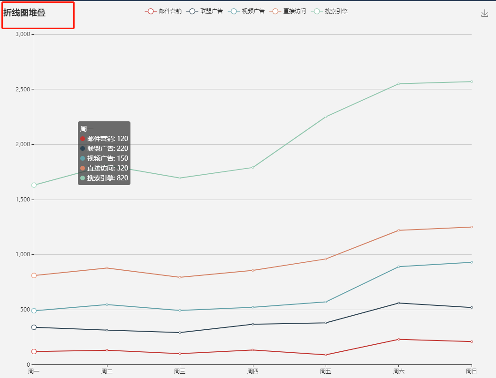
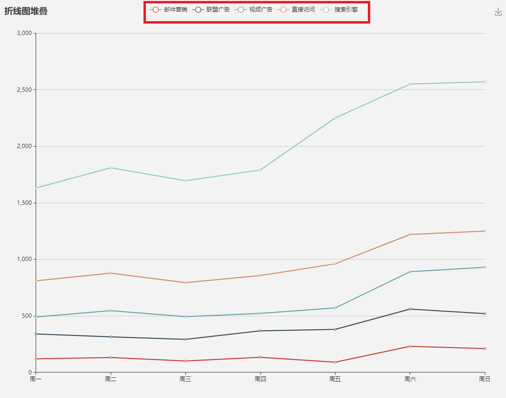
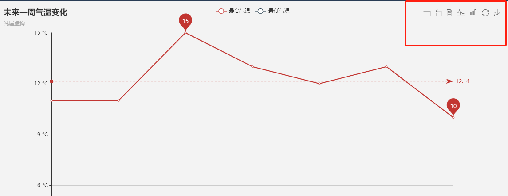
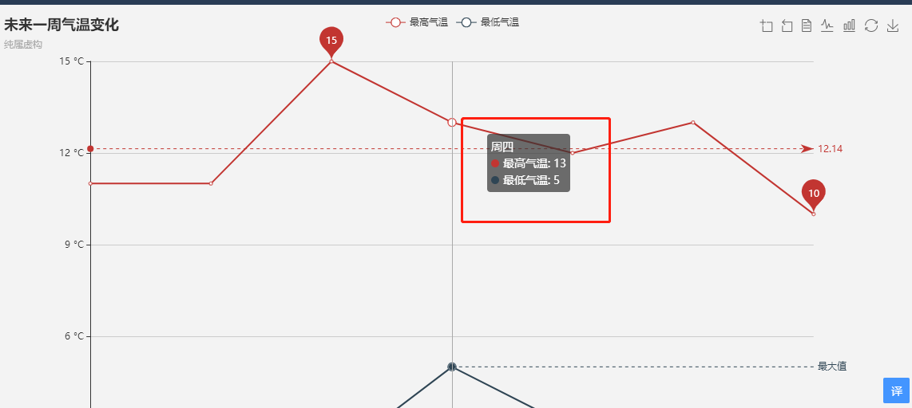
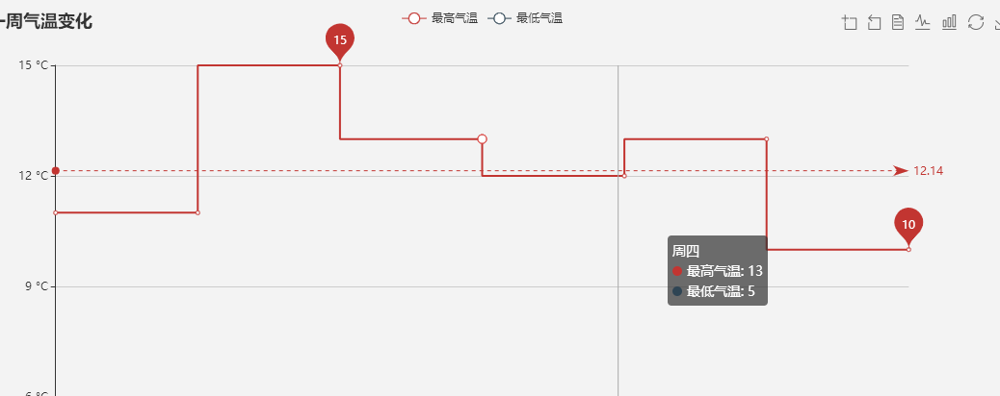

## echarts使用
安装
`npm install echarts --save`

引入
`import echarts from 'echarts'`

引入柱状图
`require('echarts/lib/chart/bar');`

引入提示框和标题组件
`require('echarts/lib/component/tooltip');`
`require('echarts/lib/component/title');`

更多。。。。。


## 属性说明
初始化echarts实例

```
var myChart = echarts.init(document.getElementById('main'));
myChart.setOption({
    title{},
    tooltip{},
    grid:{},
    legend{},
    toolbox{}
    xAxis{},
    yAxis{},
    series{}
})
```

## title

`标题组件，包含主标题和副标题。`

 [更多](https://www.echartsjs.com/zh/option.html#title)
```
title: {
        text: '折线图堆叠', //主标题文本，支持使用 \n 换行。
        x:'center', //可忽略 . x轴居中
        textStyle:{
            color:'',
            fontSize:number||18   
        }
    },

```


## legend

`图例组件。图例组件展现了不同系列的标记(symbol)，颜色和名字。可以通过点击图例控制哪些系列不显示。`

 [更多](https://www.echartsjs.com/zh/option.html#legend)

```
legend: {
        data:['邮件营销','联盟广告','视频广告','直接访问','搜索引擎'],
        itemGap:number||10, //图例每项之间的间隔。横向布局时为水平间隔，纵向布局时为纵向间隔。
        itemWidth:number||25, //图例标记的图形宽度。
        selectedMode:boolean||true, //控制是否可以通过点击图例改变系列的显示状态。
        
    },
```



## grid

`直角坐标系内绘图网格，单个 grid 内最多可以放置上下两个 X 轴，左右两个 Y 轴。可以在网格上绘制折线图，柱状图，散点图`

[更多](https://www.echartsjs.com/zh/option.html#grid)

```
 grid: {
        left: '3%',
        right: '4%',
        bottom: '3%',  // grid 组件离容器下侧的距离。bottom 的值可以是像 20 这样的具体像素值，可以是像 '20%' 这样相对于容器高宽的百分比。
        containLabel: true,  // grid 区域是否包含坐标轴的刻度标签。
        backgroundColor:Color||'transparent' //网格背景色  注意：此配置项生效的前提是，设置了 show: true。
    },
```

## xAxis

`直角坐标系 grid 中的 x 轴`

[更多](https://www.echartsjs.com/zh/option.html#xAxis)

```
xAxis: {
        type:string||'category', 
        // 'value' 数值轴，适用于连续数据。
        // 'category' 类目轴，适用于离散的类目数据，为该类型时必须通过 data 设置类目数据。 
        // 'time' 时间轴，适用于连续的时序数据，与数值轴相比时间轴带有时间的格式化，在刻度计算上也有所不同，例如会根据跨度的范围来决定使用月，星期，日还是小时范围的刻度。
        // 'log' 对数轴。适用于对数数据。
        boundaryGap: boolean, Array||true, // true,这时候刻度只是作为分隔线，标签和数据点都会在两个刻度之间的带(band)中间。
        data: ['周一','周二','周三','周四','周五','周六','周日'],
        position:string||'bottom',  // x 轴在 grid 的下方（'bottom'）
        name:'', //x 坐标名字
        min:number, string, function, //坐标轴刻度最小值。
        axisLine:{           //坐标轴轴线相关设置。 
            show:boolean||ture,
            symbol:string，Array||['none','none']  //['none', 'arrow']。末端显示箭头
        }, 
        axisTick：{  //坐标轴刻度相关设置。
            show:boolean||true,  //是否显示坐标轴刻度。 
        },
        splitLine:{ //坐标轴在 grid 区域中的分隔线。
            show: true
        }
    },
```
> boundaryGap.坐标轴两边留白策略，类目轴和非类目轴的设置和表现不一样。    
类目轴中 boundaryGap 可以配置为 true 和 false。默认为 true，这时候刻度只是作为分隔线，标签和数据点都会在两个刻度之间的带(band)中间。     
非类目轴，包括时间，数值，对数轴，boundaryGap是一个两个值的数组，分别表示数据最小值和最大值的延伸范围，可以直接设置数值或者相对的百分比，在设置 min 和 max 后无效。    
示例：boundaryGap: ['20%', '20%']


## yAxis

`直角坐标系 grid 中的 y 轴`

与xAxis类似

[更多](https://www.echartsjs.com/zh/option.html#yAxis)

```
    type: 'value',
        axisLabel: {  //坐标轴刻度标签的相关设置。
            formatter: '{value} °C'
        }
```

> formatter,刻度标签的内容格式器，支持字符串模板和回调函数两种形式。     
// 使用字符串模板，模板变量为刻度默认标签 {value}    
formatter: '{value} kg'    
// 使用函数模板，函数参数分别为刻度数值（类目），刻度的索引    
formatter: function (value, index) {
    // 格式化成月/日，只在第一个刻度显示年份    
    var date = new Date(value);    
    var texts = [(date.getMonth() + 1), date.getDate()];    
    if (index === 0) {    
        texts.unshift(date.getYear());    
    }    
    return texts.join('/');    
}


## toolbox

`工具栏。内置有导出图片，数据视图，动态类型切换，数据区域缩放，重置五个工具。`

[更多](https://www.echartsjs.com/zh/option.html#toolbox)

```
toolbox: {
        itemSize:number||15, //工具栏 icon 的大小。
        itemGap:number||10, //工具栏 icon 每项之间的间隔。
        orient:string||'horizontal', //工具栏 icon 的布局朝向。  可选:'horizontal','vertical'
        feature: {  //各工具配置项。
            saveAsImage: { //保存为图片。
                name:string||'title.text',
                type:string||'png', //保存的图片格式。支持 'png' 和 'jpeg'。
                excludeComponents:Array||['toolbox'],  // 保存为图片时忽略的组件列表，默认忽略工具栏。
                title:'保存为图片'   
            },
            restore:{  //配置项还原。
                title:'还原',
                icon:'image://http://xxx.xxx.xxx/a/b.png' 

            },
            dataView:{ //数据视图工具，可以展现当前图表所用的数据，编辑后可以动态更新。
                title:'数据视图',
                readOnly:boolean||false, //是否不可编辑（只读）。 
                optionToContent:function(){},
                lang:Array||['数据视图', '关闭', '刷新'],  //数据视图上有三个话术
            },
            dataZoom:{  //数据区域缩放。目前只支持直角坐标系的缩放。

            },
            magicType:{
                type: ['line', 'bar', 'stack', 'tiled']
            }     
        },

    },
```

> optionToContent    
自定义 dataView 展现函数，用以取代默认的 textarea 使用更丰富的数据编辑。可以返回 dom 对象或者 html 字符串。
```
optionToContent: function(opt) {
    var axisData = opt.xAxis[0].data;
    var series = opt.series;
    var table = '<table style="width:100%;text-align:center"><tbody><tr>'
                 + '<td>时间</td>'
                 + '<td>' + series[0].name + '</td>'
                 + '<td>' + series[1].name + '</td>'
                 + '</tr>';
    for (var i = 0, l = axisData.length; i < l; i++) {
        table += '<tr>'
                 + '<td>' + axisData[i] + '</td>'
                 + '<td>' + series[0].data[i] + '</td>'
                 + '<td>' + series[1].data[i] + '</td>'
                 + '</tr>';
    }
    table += '</tbody></table>';
    return table;
}
```



## tooltip

`提示框组件。`

[更多](https://www.echartsjs.com/zh/option.html#tooltip)

提示框组件可以设置在多种地方：

+ 可以设置在全局，即 tooltip

+ 可以设置在坐标系中，即 grid.tooltip、polar.tooltip、single.tooltip

+ 可以设置在系列中，即 series.tooltip

+ 可以设置在系列的每个数据项中，即 series.data.tooltip

```
tooltip: {
        trigger:string||'item', //触发类型。
        // 'item',数据项图形触发，主要在散点图，饼图等无类目轴的图表中使用。
        // 'axis'  坐标轴触发，主要在柱状图，折线图等会使用类目轴的图表中使用。
        // 'none'  什么都不触发。
        axisPointer：{  //坐标轴指示器配置项。
            type:string||'line', //指示器类型。  'line' 直线指示器  'shadow' 阴影指示器  'none' 无指示器  'cross' 十字准星指示器。其实是种简写，表示启用两个正交的轴的 axisPointer。
            snap:boolean||true,  // 坐标轴指示器是否自动吸附到点上
        }，
        triggerOn:string||'mousemove|click', //提示框触发的条件
        //'mousemove' 鼠标移动时触发。
        //'click'  鼠标点击时触发。
        //'mousemove|click'  同时鼠标移动和点击时触发。
        // 'none' 不在 'mousemove' 或 'click' 时触发，用户可以通过 action.tooltip.showTip 和 action.tooltip.hideTip 来手动触发和隐藏。也可以通过 axisPointer.handle 来触发或隐藏。
        showDelay:number||0, //浮层显示的延迟，单位为 ms
        hideDelay:number||0, //浮层隐藏的延迟，单位为 ms
        enterable:boolean||false, //鼠标是否可进入提示框浮层中，如需详情内交互，如添加链接，按钮，可设置为 true。
        confine:boolean||false, //是否将 tooltip 框限制在图表的区域内。
        transitionDuration:number||0.4, // 提示框浮层的移动动画过渡时间，单位是 s，设置为 0 的时候会紧跟着鼠标移动。
        backgroundColor:Color||'rgba(50,50,50,0.7)', //提示框浮层的背景颜色。
        borderColor:Color||'#333', // 提示框浮层的边框颜色。
        borderWidth:number||0, //提示框浮层的边框宽。
        padding:number||5, //提示框浮层内边距，单位px，默认各方向内边距为5，接受数组分别设定上右下左边距。 [5, 10]
        textStyle:{
            color:Color||'#fff',
            fontStyle:string||'normal',
            fontSize:number||14,
        }
    },
```



## series

`系列列表。每个系列通过 type 决定自己的图表类型`

[更多](https://www.echartsjs.com/zh/option.html#series)

```
 series[{
     type:'', // 'line' 折线，面积图   'bar' 柱状/条形图  'pie' 饼图
 }]
```

## line

`折线/面积图`

```
series:[{
     type:'line', 
     name:'',  //系列名称，用于tooltip的显示，legend 的图例筛选，在 setOption 更新数据和配置项时用于指定对应的系列。
     symbol:string, Function||'emptyCircle',
     //ECharts 提供的标记类型包括 'circle', 'rect', 'roundRect', 'triangle', 'diamond', 'pin', 'arrow', 'none'
     //可以通过 'image://url' 设置为图片, 'image://http://xxx.xxx.xxx/a/b.png'
     symbolSize:number, Array, Function||4,   //标记的大小
    step:string, boolean||false,  //
    // 是否是阶梯线图。可以设置为 true 显示成阶梯线图，也支持设置成 'start', 'middle', 'end' 分别配置在当前点，当前点与下个点的中间点，下个点拐弯。
    smooth:boolean, number||false, // 是否平滑曲线显示。 true==0.5
    markPoint:{
        symbol:'',  //同上
        data:[{
            name: '最大值',
            type: 'max'
        }, 
        {
            name: '某个坐标',
            coord: [10, 20]
        }, {
            name: '固定 x 像素位置',
            yAxis: 10,
            x: '90%'
        }, 
        {
            name: '某个屏幕坐标',
            x: 100,
            y: 100
        }]

    }
 }]
```

> step:true    



## bar

`柱状/条形图`

```
series:[{
    type:'bar', 
    barGap:string||'30%',  //不同系列的柱间距离,为百分比（如 '30%'，表示柱子宽度的 30%）('-100%'时两个系列的柱子重叠)
    barCategoryGap：string||'20%', //同一系列的柱间距离 
    barWidth：number, string||auto, //柱条的宽度
    itemStyle:{  //图形样式
        color:'',  // 柱条的颜色
        borderColor:'' // 柱条的描边颜色
        borderWidth:number||0, // 柱条的描边宽度
        borderType:string||'solid',  // 柱条的描边类型，默认为实线
        barBorderRadius:number, Array||0, // 圆角半径，单位px，支持传入数组分别指定 4 个圆角半径
    }, 
    emphasis:{}, // 高亮的图形样式和标签样式

}]
```
[查看更多emphasis属性](https://www.echartsjs.com/zh/option.html#series-bar.emphasis)
