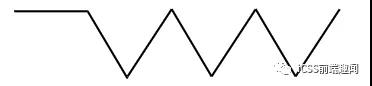
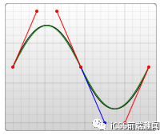
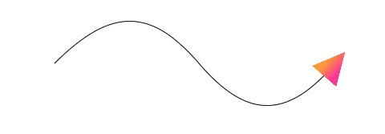
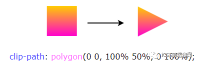
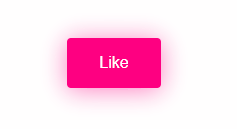
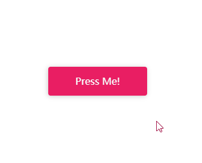
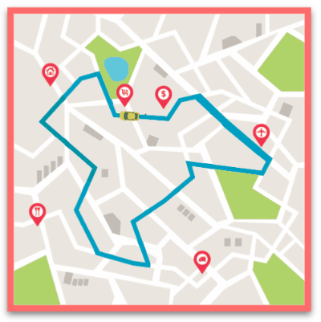
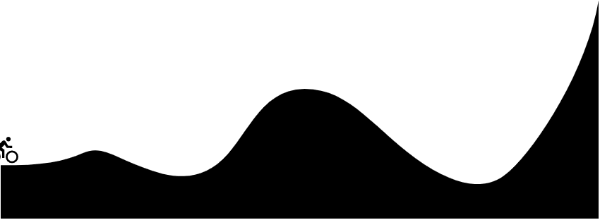

# 动画

## Motion Path（运动路径动画）

### CSS 传统方式实现直线路径动画
```css
div {
    width: 60px;
    height: 60px;
    background: #000;
    animation: move infinite 1s alternate linear;
}
@keyframes move {
    100% {
        transform: translate(100px, 100px);
    }
}
```

### CSS 传统方式实现曲线路径动画
```html
<div class="g-container">
    <div class="g-ball"></div>
</div>
```
```css
.g-container {
    position: relative;
    width: 10vmin;
    height: 70vmin;
    transform-origin: center 0;
    animation: rotate 1.5s infinite alternate;
}
.g-ball {
    position: absolute;
    width: 10vmin;
    height: 10vmin;
    border-radius: 50%;
    background: radial-gradient(circle, #fff, #000);
    bottom: 0;
    left: 0;
}
@keyframes rotate {
    100% {
        transform: rotate(90deg);
    }
}
```

### CSS `Motion Path` 实现直线路径动画

CSS Motion Path 规范主要包含以下几个属性：
+ `offset-path`：接收一个 SVG 路径（与 SVG 的path、CSS 中的 clip-path 类似），指定运动的几何路径
+ `offset-distance`：控制当前元素基于 `offset-path` 运动的距离
+ `offset-position`：指定 `offset-path` 的初始位置
+ `offset-anchor`：定义沿 `offset-path` 定位的元素的锚点。这个也算好理解，运动的元素可能不是一个点，那么就需要指定元素中的哪个点附着在路径上进行运动
+ `offset-rotate`：定义沿 `offset-path` 定位时元素的方向，说人话就是运动过程中元素的角度朝向

#### eg1
```css
div {
    width: 60px;
    height: 60px;
    background: linear-gradient(#fc0, #f0c);
    offset-path: path("M 0 0 L 100 100");
    offset-rotate: 0deg;
    animation: move 2000ms infinite alternate ease-in-out;
}
@keyframes move {
    0% {
        offset-distance: 0%;
    }
    100% {
        offset-distance: 100%;
    }
}
```

`offset-path` 接收一个 SVG 的 path 路径，这里我们的路径内容是一条自定义路径 `path("M 0 0 L 100 100")`，翻译过来就是从 `0 0` 点运动到 `100px 100px` 点。


#### eg2
```css
div {
    // 只改变运动路径，其他保持一致
    offset-path: path("M 0 0 L 100 0 L 200 0 L 300 100 L 400 0 L 500 100 L 600 0 L 700 100 L 800 0");
    animation: move 2000ms infinite alternate linear;
}
@keyframes move {
    0% {
        offset-distance: 0%;
    }
    100% {
        offset-distance: 100%;
    }
}
```
运用了 path 中的 L 指令得到一条直线路径   


与利用 transform: translate() 添加多个关键帧类似    


### CSS `Motion Path` 实现曲线路径动画

只需要在 `offset-path: path()` 中添加曲线相关的路径即可

在 SVG 的 Path 中，我们取其中一种绘制曲线的方法 -- 贝塞尔曲线，譬如下述这条 path，其中的 path 为 `d="M 10 80 C 80 10, 130 10, 190 80 S 300 150, 360 80"`
```html
<svg width="400" height="160" xmlns="http://www.w3.org/2000/svg">
  <path d="M 10 80 C 80 10, 130 10, 190 80 S 300 150, 360 80" stroke="black" fill="transparent"/>
</svg>  
```



将对应的路径应用在 `offset-path: path` 中：
```css
div:nth-child(2) {
    width: 40px;
    height: 40px;
    background: linear-gradient(#fc0, #f0c);
    offset-path: path('M 10 80 C 80 10, 130 10, 190 80 S 300 150, 360 80');
}
@keyframes move {
    0% {
        offset-distance: 0%;
    }
    100% {
        offset-distance: 100%;
    }
}
```


可以看到，元素是沿着贝塞尔曲线的路径进行运动的，并且，由于这次没有限制死 `offset-rotate`，元素的朝向也是跟随路径的朝向一直变化的。（可以联想成开车的时候，车头一直跟随道路会进行变化的，带动整个车身的角度变化）


### 理解 `offset-anchor` 运动锚点



***[CodePen Demo -- CSS Motion Path offset-anthor Demo](https://codepen.io/Chokcoco/pen/poRGZeE)***

通过 `clip-path` 实现三角形
```css
width: 40px;
height: 40px;
clip-path: polygon(0 0, 100% 50%, 0 100%);
background: linear-gradient(#fc0, #f0c);
```



常而言，沿着曲线运动的是物体的中心点（类比 `transform-origin`），在这里，我们可以通过 `offset-anchor` 改变运动的锚点，譬如，我们希望三角形的最下方沿着曲线运动：
```css
.ball {
    width: 40px;
    height: 40px;
    clip-path: polygon(0 0, 100% 50%, 0 100%);
    offset-path: path('M 10 80 C 80 10, 130 10, 190 80 S 300 150, 360 80');
    offset-anchor: 0 100%;
    background: linear-gradient(#fc0, #f0c);
    animation: move 3000ms infinite alternate linear;
}
@keyframes move {
    0% {
        offset-distance: 0%;
    }
    100% {
        offset-distance: 100%;
    }
}
```
!> 经过实测，Can i use 上写着 `offset-anchor` 属性的兼容性在为 Chrome 79+、Firefox 72+，但是实际只有 Firefox 支持，Chrome 下暂时无法生效~


### 运用 `Motion Path` 制作动画效果

#### 利用 `Motion Path` 制作按钮效果


***[CodePen Demo -- Bubbly button (Design by Gal Shir)](https://codepen.io/Chokcoco/pen/bGGMLdd)***



***[CodePen Demo -- Button Animation with CSS Offset Paths](https://codepen.io/Chokcoco/pen/xxgMPzJ)***


#### 利用 `Motion-Path` 绘制地图路径寻路动画


***[CodePen Demo -- CodePen Home Animation with offset-path | Only Using CSS & HTML](https://codepen.io/ahmadbassamemran/pen/bXByBv)***


#### 利用 `Motion-Path` 绘制路径动画


***[CodePen Demo -- CSS Motion Path offset-path animation](https://codepen.io/Chokcoco/pen/dyNaZea)***