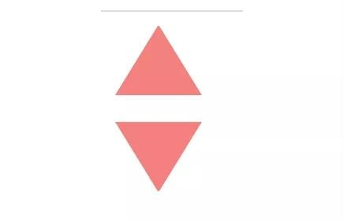
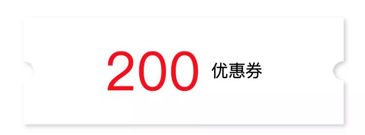

# 纯CSS功能


## 滚动条(scrollbar)

### 隐藏滚动条
```css
.no-bar ::-webkit-scrollbar{
  width: 0;
  height: 0;
  color: transparent;
  display: none
}
```

### 自定义滚动条
```css
 .scroll-container::-webkit-scrollbar {
   width: 8px;
   background: white;
 }
 
 .scroll-container::-webkit-scrollbar-corner,
   /* 滚动条角落 */
 .scroll-container::-webkit-scrollbar-thumb,
 .scroll-container::-webkit-scrollbar-track {      /*滚动条的轨道*/
   border-radius: 4px;
 }
 
 .scroll-container::-webkit-scrollbar-corner,
 .scroll-container::-webkit-scrollbar-track {
   /* 滚动条轨道 */
   background-color: rgba(180, 160, 120, 0.1);
   box-shadow: inset 0 0 1px rgba(180, 160, 120, 0.5);
 }
 
 .scroll-container::-webkit-scrollbar-thumb {
   /* 滚动条手柄 */
   background-color: #00adb5;
 }
```
```html
<p class="scroll-container">
        庭院深深，不知有多深？杨柳依依，飞扬起片片烟雾，一重重帘幕不知有多少层。豪华的车马停在贵族公子寻欢作乐的地方，她登楼向远处望去，却看不见那通向章台的大路。春已至暮，三月的雨伴随着狂风大作，再是重门将黄昏景色掩闭，也无法留住春意。泪眼汪汪问落花可知道我的心意，落花默默不语，纷乱的，零零落落一点一点飞到秋千外。庭院深深，不知有多深？杨柳依依，飞扬起片片烟雾，一重重帘幕不知有多少层。豪华的车马停在贵族公子寻欢作乐的地方，她登楼向远处望去，却看不见那通向章台的大路。春已至暮，三月的雨伴随着狂风大作，再是重门将黄昏景色掩闭，也无法留住春意。泪眼汪汪问落花可知道我的心意，落花默默不语，纷乱的，零零落落一点一点飞到秋千外。庭院深深，不知有多深？杨柳依依，飞扬起片片烟雾，一重重帘幕不知有多少层。豪华的车马停在贵族公子寻欢作乐的地方，她登楼向远处望去，却看不见那通向章台的大路。春已至暮，三月的雨伴随着狂风大作，再是重门将黄昏景色掩闭，也无法留住春意。泪眼汪汪问落花可知道我的心意，落花默默不语，纷乱的，零零落落一点一点飞到秋千外。庭院深深，不知有多深？杨柳依依，飞扬起片片烟雾，一重重帘幕不知有多少层。豪华的车马停在贵族公子寻欢作乐的地方，她登楼向远处望去，却看不见那通向章台的大路。春已至暮，三月的雨伴随着狂风大作，再是重门将黄昏景色掩闭，也无法留住春意。泪眼汪汪问落花可知道我的心意，落花默默不语，纷乱的，零零落落一点一点飞到秋千外。
</p>
```

## 纯CSS绘制三角形
```css
/* 正三角 */
.up-triangle {
   width: 0;
   height: 0;
   border-style: solid;
   border-width: 0 25px 40px 25px;
   border-color: transparent transparent rgb(245, 129, 127) transparent;
 }
 
 /* 倒三角 */
 .down-triangle {
   width: 0;
   height: 0;
   border-style: solid;
   border-width: 40px 25px 0 25px;
   border-color:  rgb(245, 129, 127) transparent transparent transparent;
 }
```



## 卡券效果制作
```css
.coupon {
 width: 300px;
  height: 100px;
  line-height: 100px;
  margin: 50px auto;
  text-align: center;
  position: relative;
  background: radial-gradient(circle at right bottom, transparent 10px, #ffffff 0) top right /50% 51px no-repeat,
  radial-gradient(circle at left bottom, transparent 10px, #ffffff 0) top left / 50% 51px no-repeat,
  radial-gradient(circle at right top, transparent 10px, #ffffff 0) bottom right / 50% 51px no-repeat,
  radial-gradient(circle at left top, transparent 10px, #ffffff 0) bottom left / 50% 51px no-repeat;
  filter: drop-shadow(2px 2px 2px rgba(0, 0, 0, .2));
}
.coupon span {
  display: inline-block;
  vertical-align: middle;
  margin-right: 10px;
  color: red;
  font-size: 50px;
  font-weight: 400;
}
```
```html
<p class="coupon">
 <span>200</span>优惠券
</p>
```



## 边框（border）动画

### border 属性

solid，dashed，  none，hidden， dotted， double， groove， ridge， inset， outset

### 边框长度变化

<details>
<summary>代码</summary>

```html
<div class="border-1"></div>
```
```css
div.border-1 {
  width:150px;
  height:150px;
  position: relative;
  border: 1px solid var(--theme-color);
}
div.border-1::before,
div.border-1::after {
    content: "";
    position: absolute;
    width: 50px;
    height: 50px;
    transition: all 0.2s;
}
div.border-1::before {
    top: -10px;
    left: -10px;
    border-top: 1px solid var(--theme-color);
    border-left: 1px solid var(--theme-color);
}

div.border-1::after {
    right: -10px;
    bottom: -10px;
    border-bottom: 1px solid var(--theme-color);
    border-right: 1px solid var(--theme-color);
}

div.border-1:hover::before,
div.border-1:hover::after {
    width: calc(100% + 19px);
    height: calc(100% + 19px);
}
```
</details>


<div class="border-1"></div>

<style >
div.border-1 {
  width:150px;
  height:150px;
  position: relative;
  border: 1px solid var(--theme-color);
  margin-top:20px;
}
div.border-1::before,
div.border-1::after {
    content: "";
    position: absolute;
    width: 50px;
    height: 50px;
    transition: all 0.2s;
}
div.border-1::before {
    top: -10px;
    left: -10px;
    border-top: 1px solid var(--theme-color);
    border-left: 1px solid var(--theme-color);
}

div.border-1::after {
    right: -10px;
    bottom: -10px;
    border-bottom: 1px solid var(--theme-color);
    border-right: 1px solid var(--theme-color);
}

div.border-1:hover::before,
div.border-1:hover::after {
    width: calc(100% + 19px);
    height: calc(100% + 19px);
}
</style>


### 虚线边框动画

使用 dashed 关键字，可以方便的创建虚线边框。但不能让边框够动起来。

使用渐变替换border实现虚线边框。

#### eg1

<details>
<summary>代码</summary>

```html
<div class="border-2"></div>
```
```css
div.border-2 {
  width:100px;
  height:100px;
  background: 
      linear-gradient(90deg, #333 50%, transparent 0) repeat-x,
      linear-gradient(90deg, #333 50%, transparent 0) repeat-x,
      linear-gradient(0deg, #333 50%, transparent 0) repeat-y,
      linear-gradient(0deg, #333 50%, transparent 0) repeat-y;
  background-size: 4px 1px, 4px 1px, 1px 4px, 1px 4px;
  background-position: 0 0, 0 100%, 0 0, 100% 0;
}
div.border-2:hover {
    animation: linearGradientMove .3s infinite linear;
}
@keyframes linearGradientMove {
  100% {
      background-position: 4px 0, -4px 100%, 0 -4px, 100% 4px;
  }
}
```
</details>

<div class="border-2"></div>
<style>
div.border-2 {
  width:150px;
  height:150px;
  background: 
      linear-gradient(90deg, #333 50%, transparent 0) repeat-x,
      linear-gradient(90deg, #333 50%, transparent 0) repeat-x,
      linear-gradient(0deg, #333 50%, transparent 0) repeat-y,
      linear-gradient(0deg, #333 50%, transparent 0) repeat-y;
  background-size: 4px 1px, 4px 1px, 1px 4px, 1px 4px;
  background-position: 0 0, 0 100%, 0 0, 100% 0;
}
div.border-2:hover {
    animation: linearGradientMove .1s infinite linear;
}
@keyframes linearGradientMove {
  100% {
      background-position: 4px 0, -4px 100%, 0 -4px, 100% 4px;
  }
}
</style>


#### eg2

<details>
<summary>代码</summary>

```html
<div class="border-3"></div>
```
```css
div.border-3 {
  width:150px;
  height:150px;
  border: 1px solid #333;
  outline: 1px solid #333;
  outline-offset: -1px;
  &:hover {
      border: none;
      background: 
          linear-gradient(90deg, #333 50%, transparent 0) repeat-x,
          linear-gradient(90deg, #333 50%, transparent 0) repeat-x,
          linear-gradient(0deg, #333 50%, transparent 0) repeat-y,
          linear-gradient(0deg, #333 50%, transparent 0) repeat-y;
      background-size: 4px 1px, 4px 1px, 1px 4px, 1px 4px;
      background-position: 0 0, 0 100%, 0 0, 100% 0;
  }
}
@keyframes linearGradientMove {
  100% {
      background-position: 4px 0, -4px 100%, 0 -4px, 100% 4px;
  }
}
```
</details>

<div class="border-3"></div>
<style>
div.border-3 {
  width:150px;
  height:150px;
  border: 1px solid #333;
  outline: 1px solid #333;
  outline-offset: -1px;
}
div.border-3:hover {
  border: none;
  outline: none;
  background: 
      linear-gradient(90deg, #333 50%, transparent 0) repeat-x,
      linear-gradient(90deg, #333 50%, transparent 0) repeat-x,
      linear-gradient(0deg, #333 50%, transparent 0) repeat-y,
      linear-gradient(0deg, #333 50%, transparent 0) repeat-y;
  background-size: 4px 1px, 4px 1px, 1px 4px, 1px 4px;
  background-position: 0 0, 0 100%, 0 0, 100% 0;
  animation: linearGradientMove .1s infinite linear;
}
@keyframes linearGradientMove {
  100% {
      background-position: 4px 0, -4px 100%, 0 -4px, 100% 4px;
  }
}
</style>


#### eg3

<details>
<summary>代码</summary>

```html
<div class="border-4"></div>
<div class="border-4 border-4--has-border"></div>
```

```css
div.border-4 {
    width:150px;
    height:150px;
    position: relative;
    overflow:hidden
}
div.border-4::before {
    content: '';
    animation: rotate 4s linear infinite;
    position: absolute;
    left: -50%;
    top: -50%;
    width: 200%;
    height: 200%;
    background-repeat: no-repeat;
    background-size: 50% 50%, 50% 50%;
    background-position: 0 0, 100% 0, 100% 100%, 0 100%;
    background-image: linear-gradient(#399953, #399953), linear-gradient(#fbb300, #fbb300), linear-gradient(#d53e33, #d53e33), linear-gradient(#377af5, #377af5);
}
div.border-4--has-border{
  margin-top:10px
}
div.border-4--has-border::after{
    content: '';
    position: absolute;
    left: 0;
    top: 0;
    bottom:0;
    right:0;
    margin:auto;
    width: calc( 100% - 10px );
    height: calc( 100% - 10px );
    background-color:#fff;
}
@keyframes rotate {
 100% {
  transform: rotate(1turn);
 }
}
```
</details>


<div class="border-4"></div>
<div class="border-4 border-4--has-border"></div>
<style>
div.border-4 {
    width:150px;
    height:150px;
    position: relative;
    overflow:hidden
}
div.border-4::before {
    content: '';
    animation: rotate 4s linear infinite;
    position: absolute;
    left: -50%;
    top: -50%;
    width: 200%;
    height: 200%;
    background-repeat: no-repeat;
    background-size: 50% 50%, 50% 50%;
    background-position: 0 0, 100% 0, 100% 100%, 0 100%;
    background-image: linear-gradient(#399953, #399953), linear-gradient(#fbb300, #fbb300), linear-gradient(#d53e33, #d53e33), linear-gradient(#377af5, #377af5);
}
div.border-4--has-border{
  margin-top:10px
}
div.border-4--has-border::after{
    content: '';
    position: absolute;
    left: 0;
    top: 0;
    bottom:0;
    right:0;
    margin:auto;
    width: calc( 100% - 10px );
    height: calc( 100% - 10px );
    background-color:#fff;
}
@keyframes rotate {
 100% {
  transform: rotate(1turn);
 }
}
</style>


#### eg4 

<details>
<summary>代码</summary>

```html
<div class="border-5 border-5--has-border"></div>
```

```css
div.border-5{
  width:150px;
  height:150px;
  position: relative;
  overflow:hidden;
}
div.border-5::before {
  content: '';
  animation: rotate 4s linear infinite;
  position: absolute;
  left: -50%;
  top: -50%;
  width: 200%;
  height: 200%;
  background-color: #fff;
  background-repeat: no-repeat;
  background-size: 50% 50%;
  background-position: 0 0;
  background-image: linear-gradient(#399953, #399953);
}
div.border-5--has-border::after{
  content: '';
  position: absolute;
  left: 0;
  top: 0;
  bottom:0;
  right:0;
  margin:auto;
  width: calc( 100% - 10px );
  height: calc( 100% - 10px );
  background-color:#eee;
}
@keyframes rotate {
 100% {
  transform: rotate(1turn);
 }
}
```

</details>


<div class="border-5 border-5--has-border"></div>
<style>
div.border-5{
  width:150px;
  height:150px;
  position: relative;
  overflow:hidden;
}
div.border-5::before {
  content: '';
  animation: rotate 4s linear infinite;
  position: absolute;
  left: -50%;
  top: -50%;
  width: 200%;
  height: 200%;
  background-color: #fff;
  background-repeat: no-repeat;
  background-size: 50% 50%;
  background-position: 0 0;
  background-image: linear-gradient(#399953, #399953);
}
div.border-5--has-border::after{
  content: '';
  position: absolute;
  left: 0;
  top: 0;
  bottom:0;
  right:0;
  margin:auto;
  width: calc( 100% - 10px );
  height: calc( 100% - 10px );
  background-color:#eee;
}
@keyframes rotate {
 100% {
  transform: rotate(1turn);
 }
}
</style>

#### conic-gradient 的妙用

<details>
<summary>代码</summary>

```html
<div class="border-6"></div>
<div class="border-6 border-6--has-border"></div>
```

```css
div.border-6{
  width:150px;
  height:150px;
  position: relative;
  overflow:hidden;
}
div.border-6::before {
  content: '';
  animation: rotate 4s linear infinite;
  position: absolute;
  left: -50%;
  top: -50%;
  width: 200%;
  height: 200%;
  background: conic-gradient(transparent, var(--theme-color), transparent 30%);
}
div.border-6--has-border::after{
  content: '';
  position: absolute;
  left: 0;
  top: 0;
  bottom:0;
  right:0;
  margin:auto;
  width: calc( 100% - 10px );
  height: calc( 100% - 10px );
  background-color:#eee;
}
@keyframes rotate {
 100% {
  transform: rotate(1turn);
 }
}
```
</details>


<div class="border-6"></div>
<div class="border-6 border-6--has-border"></div>
<style>
div.border-6{
  width:150px;
  height:150px;
  position: relative;
  overflow:hidden;
}
div.border-6::before {
  content: '';
  animation: rotate 4s linear infinite;
  position: absolute;
  left: -50%;
  top: -50%;
  width: 200%;
  height: 200%;
  background: conic-gradient(transparent, var(--theme-color), transparent 30%);
}
div.border-6--has-border::after{
  content: '';
  position: absolute;
  left: 0;
  top: 0;
  bottom:0;
  right:0;
  margin:auto;
  width: calc( 100% - 10px );
  height: calc( 100% - 10px );
  background-color:#eee;
}
@keyframes rotate {
 100% {
  transform: rotate(1turn);
 }
}
</style>


#### border-image 的妙用

<details>
<summary>代码</summary>

```html
<div class="border-7"></div>
```
```css
div.border-7{
  width: 200px;
  height: 120px;
  border: 24px solid;
  border-image: url('/功能/assets/纯CSS功能/边框动画_01.jpg');
  border-image-slice: 32;
  border-image-repeat: round;
}
```

</details>

<div class="border-7"></div>
<style>
div.border-7{
  width: 200px;
  height: 120px;
  border: 24px solid;
  border-image: url('/功能/assets/纯CSS功能/边框动画_01.jpg');
  border-image-slice: 32;
  border-image-repeat: round;
}
</style>


#### border-image 使用渐变

<details>
<summary>代码</summary>

```html
<div class="border-image-clip-path"></div>
```
```css
.border-image-clip-path {
    width: 200px;
    height: 100px;
    border: 10px solid;
    border-image: linear-gradient(45deg, gold, deeppink) 1;
    clip-path: inset(0px round 10px);
    animation: huerotate 6s infinite linear;
    filter: hue-rotate(360deg);
}
@keyframes huerotate {
    0% {
        filter: hue-rotate(0deg);
    }
    100% {
        filter: hue-rotate(360deg);
    }
}
```

</details>

<div class="border-image-clip-path"></div>
<style>
.border-image-clip-path {
    width: 200px;
    height: 100px;
    border: 10px solid;
    border-image: linear-gradient(45deg, gold, deeppink) 1;
    clip-path: inset(0px round 10px);
    animation: huerotate 6s infinite linear;
    filter: hue-rotate(360deg);
}
@keyframes huerotate {
    0% {
        filter: hue-rotate(0deg);
    }
    100% {
        filter: hue-rotate(360deg);
    }
}
</style>

<!-- ***引用[CSS 奇思妙想边框动画](https://mp.weixin.qq.com/s/JAOZ-NZoPnmAhL-9l0WKKQ)*** -->


## H5 ios修改手机状态栏背景色

```html
<meta name="theme-color" content="#3442d5" media="(prefers-color-scheme: light)">
```